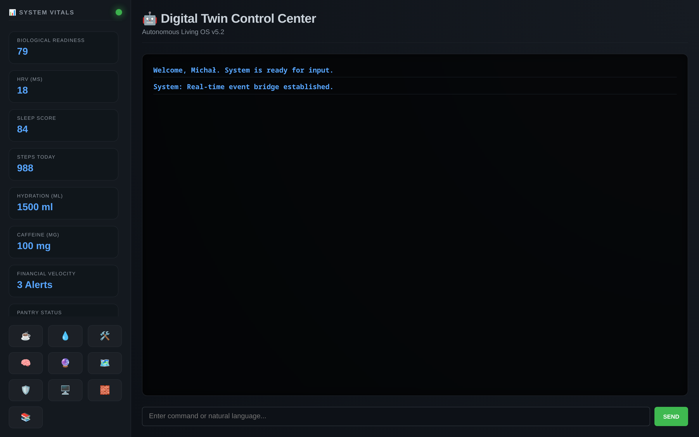
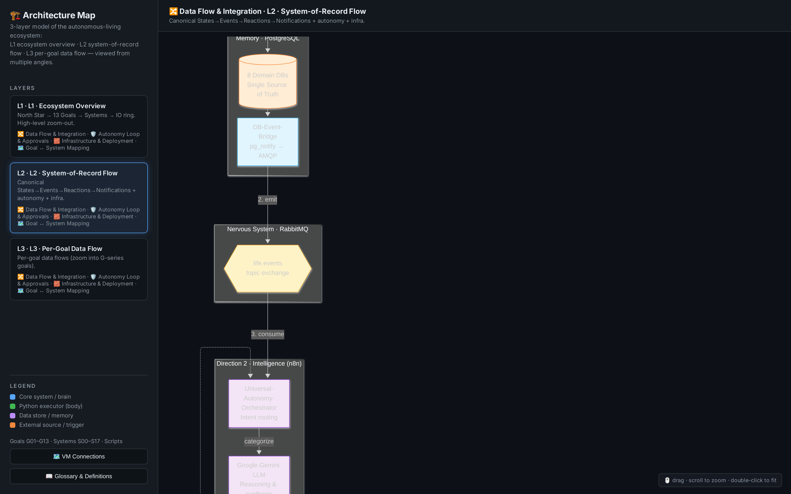
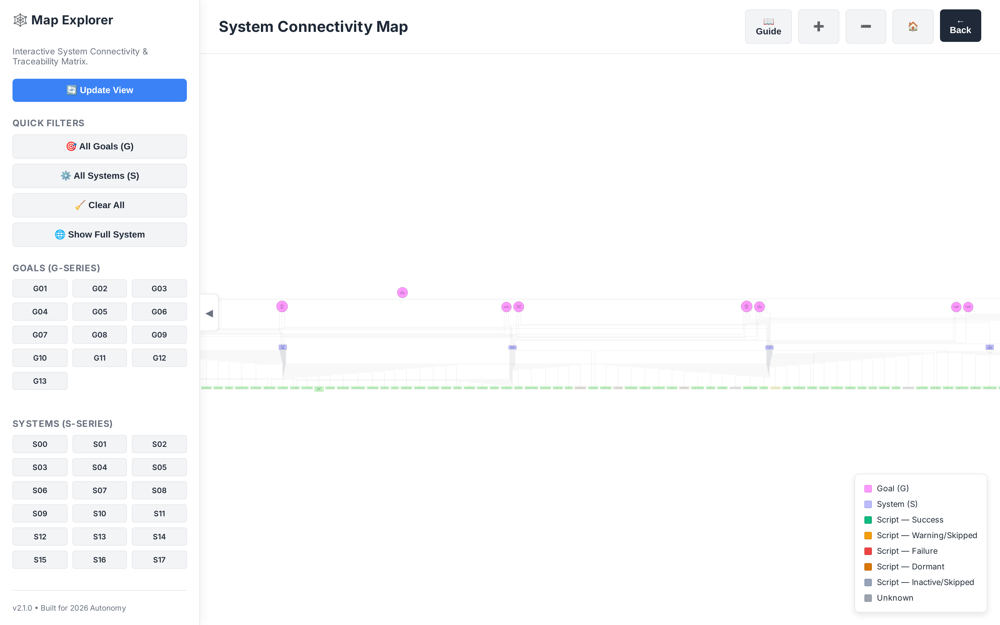
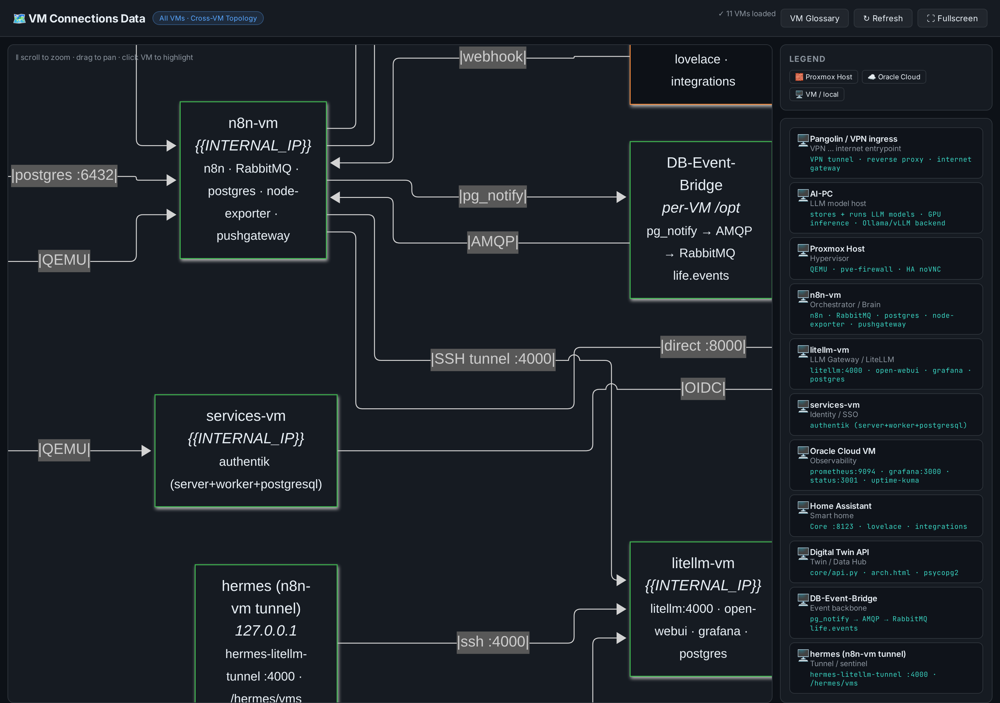
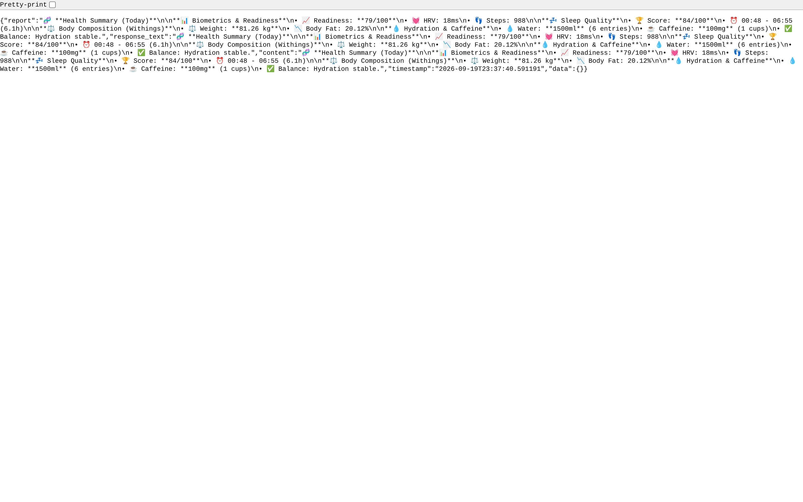
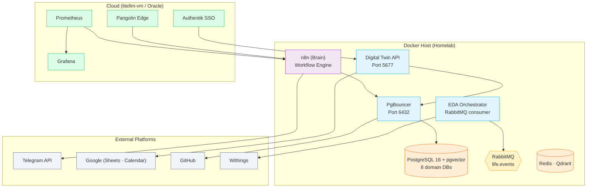

# 🤖 Autonomous Living: The Life Engineering Blueprint

## The Mission: Architecting a Fully Autonomous Life

This repository is not about building another AI chatbot. It is a comprehensive **Enterprise-Grade Blueprint** for shifting your life from manual management to **Autonomous Execution**. 

The goal is to build an **Autonomous Helper**—a hybrid system that orchestrates your logistics, health, finance, and home. By applying enterprise architectural standards to personal life, we eliminate the "mental overhead" of daily maintenance, reclaiming your time for the things that truly matter.

### Why a "Hybrid" Autonomous Approach?

Most modern solutions rely either on simple "if-this-then-that" automation or purely reactive AI chatbots. This project bridges the gap:

- **Proactive, Not Reactive:** The system doesn't wait for a prompt. It works 24/7—monitoring your metrics, predicting your needs, and taking action while you live.
- **Outcome-Driven Autonomy:** It’s not just about "chatting"—it’s about results. Whether it's restocking your pantry, optimizing your financial cash flow, or adjusting your training based on biological recovery, the system manages the entire lifecycle of the task.
- **Enterprise-Grade Reliability:** Built with the same rigor used in mission-critical corporate systems (PostgreSQL, observability, decoupled services, and ADRs).
- **Software-Agnostic Philosophy:** While this blueprint uses specific tools, the architecture is designed to be built in **any software stack**. The principles of goal-oriented design and automated state-management are universal.

> **💡 The Vision:** By the end of 2026, every repeatable task in your life should run autonomously. You wake up, and the system has already engineered your day. You are the CEO of your life; the system is your 24/7 autonomous operations team.

> [!insight] 📝 **Automationbro Insight:** [A Day in My Automation-First Life (March 2026)](https://automationbro.substack.com/p/a-day-in-my-automation-first-life)

---

## 📡 The System Is Live — See It Running

This is not a paper architecture. The system below runs 24/7 in a self-hosted homelab and exposes live dashboards.
Every screenshot in this section is captured from the running instance.

| | |
|---|---|
| **Digital Twin · Mission Control** — real-time vitals, agent status, and system health in one cockpit | **Architecture Map** — layered view from the North Star goal down to individual data flows |
|  |  |
| **Connectivity Map** — every service, platform, and what talks to what | **VM Connections** — which machines exist and how they reach each other |
|  |  |
| **Daily AI Health Report** — the system reads biometric + lifestyle data and outputs an actionable briefing every morning | |
|  | |

> 💡 All dashboards are mermaid-based and also exportable as diagrams — see
> [`docs/diagrams/`](docs/diagrams/).

---

## 🧭 System Architecture at a Glance



Detailed, layer-by-layer mermaid graphs live in [`docs/diagrams/`](docs/diagrams/):

- [`arch_L1_dataflow.mmd`](docs/diagrams/arch_L1_dataflow.mmd) — North Star → 15 goals → systems
- [`arch_L2_infra.mmd`](docs/diagrams/arch_L2_infra.mmd) — homelab / cloud / external platforms
- [`arch_L2_autonomy.mmd`](docs/diagrams/arch_L2_autonomy.mmd) — automation vs. autonomy boundary
- [`arch_L3_dataflow.mmd`](docs/diagrams/arch_L3_dataflow.mmd) — per-system data flows
- [`map_connectivity.mmd`](docs/diagrams/map_connectivity.mmd) — full service connectivity map
- [`vms_connections.mmd`](docs/diagrams/vms_connections.mmd) — VM-to-VM topology

---
## 🎯 The Philosophy: "Share the Blueprint, Let Others Build Their Own House"

This repository demonstrates how to architect resilient, integrated autonomous living ecosystems using enterprise methodologies (**ITIL 4, PRINCE2**) applied to daily life. 

*   **Goal-Driven Design:** Every line of code traces back to a specific life objective. No "tech for tech's sake."
*   **Observability First:** I treat personal metrics (health, finance) as Business KPIs in Prometheus/Grafana.
*   **Decoupled Architecture:** A 5-layer model ensuring the "Master Brain" stays modular and scalable.

> **🎯 Pick what to automate:** You don't need to automate everything. Pick what burns your time or causes stress. The goal is to free your mind for what matters - and automate what doesn't.

---

## 👨‍💻 About the Architect

**Michał** - IT T&T Automation Specialist specializing in RPA, AI, and Hyperautomation. 20+ years of experience in programming and project management in the manufacturing sector. ITIL 4 & PRINCE2 certified professional combining enterprise automation expertise with systematic life optimization.

I built this ecosystem to prove that the same patterns that run a Fortune 500 company—**Decoupling, Observability, and Automation**—can be used to build a better, more focused, and more autonomous human life.

---

## ☕ Fuel the Architecture

Building and maintaining this level of technical rigor is a massive investment. If this blueprint helps your own engineering journey, I would be grateful for your support.

<a href='https://ko-fi.com/michalnowakowski' target='_blank'></a>

**Support my hard work in engineering a fully autonomous life.** Every coffee fuels another line of code, another automated insight, and another step toward the 2026 North Star. Your contributions help maintain the infrastructure and research shared in this open-source blueprint.

---

> **📝 Who is this for?** Everyone! Whether you want to understand the concepts or build your own system. The ideas matter more than the tools - use whatever you have (Zapier, Notion, Excel, Python, n8n - all work). Don't understand a term? Check the **[Glossary](docs/00_Start-here/Glossary.md)**.

This repository documents a fully integrated, "Automation-First" ecosystem for personal life engineering. It is an **Enterprise-Grade Architectural Blueprint** that proves how 20+ years of automation evolution can be applied to daily life. 

> **💡 Software-Agnostic Design:** While this implementation uses specific tools like n8n and Home Assistant, the core patterns are universal. The goal is to show that a fully autonomous life can be architected using **any software stack** that fits your unique needs. Whether you use Python, Zapier, Notion, or custom C++, these architectural principles remain the same.

---

## 🗺️ How to Navigate

Choose the path that matches your objective:

*   **🏛️ Follow the path of an Architect:** Focus on the "Why" and "How" of system integration.
    *   [High-Level Design](docs/20_Systems/High-Level-Design.md) | [Cross-System Integration](docs/20_Systems/Cross-System-Integration.md) | [ADR Index](docs/60_Decisions_adrs/README.md)
*   **🛠️ Follow the path of Infrastructure:** Explore the containerized stack and monitoring logic.
    *   [Service Registry](docs/20_Systems/Service-Registry.md) | [Low-Level Design](docs/20_Systems/Low-Level-Design.md) | [Database Schemas](docs/10_Goals/G05_Autonomous-Financial-Command-Center/database_schemas/)
*   **🚀 Follow the path of an Implementer:** Learn how to apply these standards to your own life.
    *   [Documentation Standard](docs/10_Goals/Documentation-Standard.md) | [Standard Operating Procedures](docs/30_Sops/) | [Automation Templates](docs/50_Automations/templates/)
*   **👁️ Follow the path of an Observer:** Get the "nutshell" view of the system and its impact.
    *   **[What Is Autonomous Living?](docs/00_Start-here/02_What-Is-Autonomous-Living.md)** - **START HERE** Plain-language guide for everyone. No technical skills required.
    *   [Project in a Nutshell](docs/00_Start-here/01_Project-in-a-nutshell.md) | [North Star Vision](docs/00_Start-here/North-Star.md) | [Principles](docs/00_Start-here/Principles.md)
    *   📖 **[Glossary](docs/00_Start-here/Glossary.md)** - All technical terms explained in plain language

---

## 🏗️ Architectural Overview

### The Competitive Advantage: Goal-Oriented Architecture

Most automation projects organize by technology. This system organizes by **business value and outcomes**.

```
┌─────────────────────────────────────────────────────────────┐
│            12 Life Goals (docs/10_Goals)                    │
│    Health | Career | Finance | Home | Productivity | Meta   │
│             ↓ drives requirements for                       │
└─────────────────────────────────────────────────────────────┘
┌─────────────────────────────────────────────────────────────┐
│          10 Technical Systems (docs/20_Systems)             │
│    Homelab | Data Layer | Digital Twin | Smart Home | AI    │
│             ↓ implemented through                           │
└─────────────────────────────────────────────────────────────┘
┌─────────────────────────────────────────────────────────────┐
│       Automation Orchestration (docs/50_Automations)        │
│    n8n Workflows | Home Assistant | GitHub Actions        │
│             ↓ running on                                    │
└─────────────────────────────────────────────────────────────┘
┌─────────────────────────────────────────────────────────────┐
│              Infrastructure (docker-compose.unified.yml)    │
│    Docker | Prometheus | Grafana | PostgreSQL | Gemini AI   │
└─────────────────────────────────────────────────────────────┘
```

### 🚀 Unified Deployment (G11-SSH/PSO)
The entire ecosystem is now consolidated into a single, hardened **Unified Docker Stack**. This ensures enterprise-grade portability, security, and one-click deployment.

- **Primary Stack:** `docker-compose.unified.yml` (Consolidates Core, AI, and Monitoring)
- **Security:** Standardized on bridge networks, non-root users, and hardened API gateways.
- **Portability:** 100% relative path mapping (no more hardcoded host paths).
- **Runbook:** [RB004: Infrastructure Consolidation Procedure](docs/40_Runbooks/RB004_Infrastructure_Consolidation.md)

### Repository Structure: Enterprise IT Applied to Life
| Directory | Purpose | Status |
|:---|:---|:---|
| `00_Start-here` | Project governance and principles | Production |
| `core/` | **Kernel**: API, Orchestrator, Engine | Production |
| `modules/` | **Userland**: Domain-specific logic & scripts | Production |
| `autonomous_sdk/` | **Shared Library**: Database, Events, Logs | Production |
| `docs/` | Comprehensive technical documentation | Production |
| `infrastructure/` | Docker persistent data (DB, RabbitMQ) | Production |
| `scripts/` | **Legacy Utilities & Proxies** | **DEPRECATED** |

---

### 🚀 Modular Architecture (May 2026 Update)
The system has completed its migration to a **Modular Kernel Architecture**. 

- **Modular Logic:** Every life domain (Health, Finance, Productivity) is a self-contained module in `modules/`.
- **Centralized SDK:** All database connections, event emissions (RabbitMQ), and structured logging are handled by the `autonomous_sdk`.
- **Visibility:** 100% of automation scripts are now visible on the [Digital Twin Map](http://{{INTERNAL_IP}}:5677/map) through standardized lifecycle logging.
- **Legacy Path Deprecation:** The root `/scripts` folder is preserved for backward compatibility but is no longer the source of truth for production logic.

---

## 🎓 Key Architectural Patterns You Can Reuse
1.  **Traceability Pattern:** Every automation traces through `Automation → System → Goal`.
2.  **Multi-Tool Orchestration:** Strategic use of **n8n** (logic), **Home Assistant** (sensors), and **Python** (processing).
3.  **Digital Twin Pattern:** AI agents (Gemini 1.5 Pro) maintain contextual understanding for proactive decisions.
4.  **Temporal Data Integrity:** PostgreSQL partitioning designed for 10+ years of high-speed data access.

---

## 📊 Why This Matters for Your Career

As AI handles more implementation work, **architectural thinking** becomes the critical differentiator. This repo demonstrates:
*   **Systems Integration:** Multi-tool orchestration at enterprise scale.
*   **Operational Maturity:** SRE practices applied to complex data environments.
*   **Strategic AI Integration:** AI as a core architectural component, not just a chatbot.

---

## 📜 License & Usage

This project is released under the **[MIT License](License)**. 

I believe in the power of open-source knowledge. You are free to:
*   ✅ Adapt the structure for your own autonomous living architecture.
*   ✅ Reuse the documentation patterns and ADR frameworks.
*   ✅ Build your own implementation using these architectural principles.

---

*Built for 2026. Designed for Autonomy. Engineered for Excellence.*
