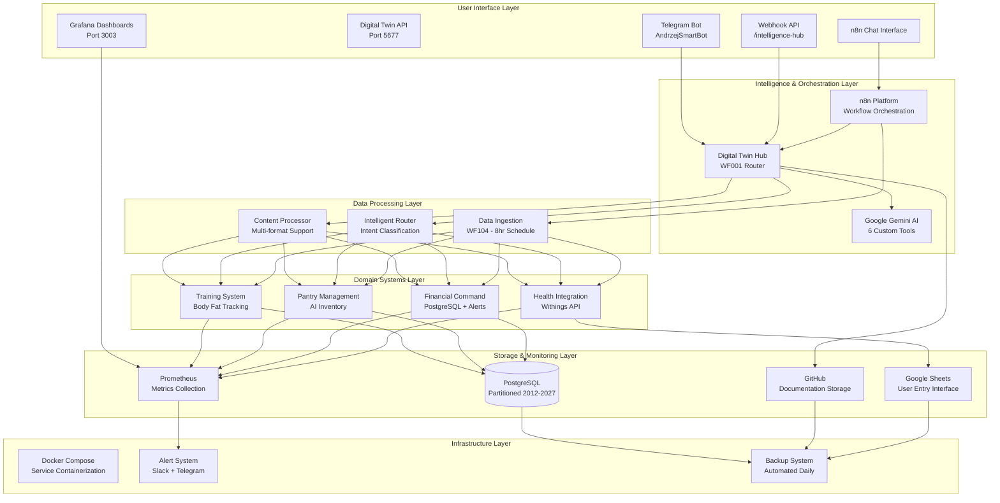
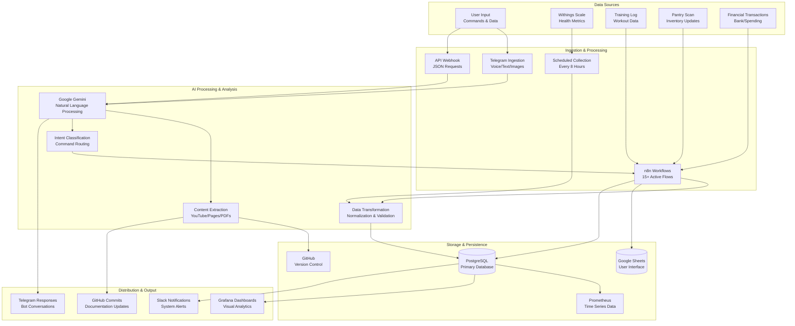
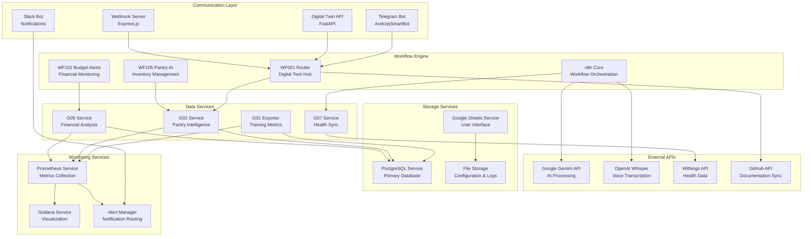
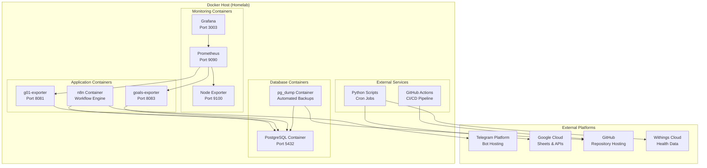
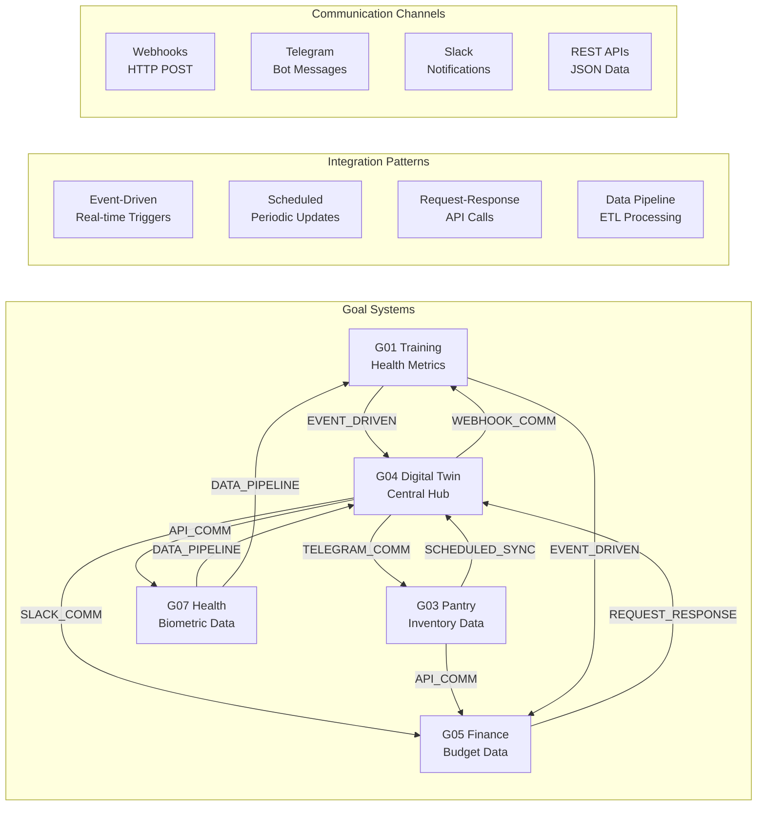
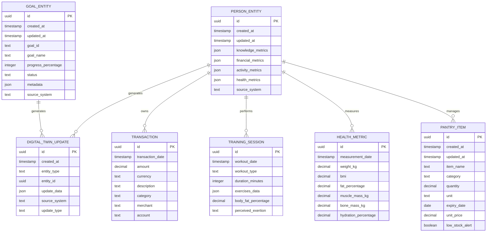
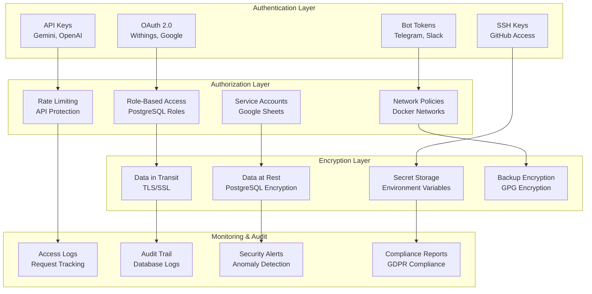

# Autonomous Living Architecture Diagrams

## Overview

This document contains high-level and low-level architectural diagrams for the autonomous-living ecosystem as of 2026-02-11.

## 🏗️ **HIGH-LEVEL SYSTEM ARCHITECTURE**

## 🔄 **DATA FLOW ARCHITECTURE**

## 🏛️ **SYSTEM COMPONENT ARCHITECTURE**

## 🐳 **DEPLOYMENT ARCHITECTURE**

## 🔗 **INTEGRATION ARCHITECTURE**

## 📊 **DATA ARCHITECTURE**

## 🔐 **SECURITY ARCHITECTURE**

---

## 📋 **DIAGRAM LEGEND**

### **Component Types**
- **Hexagons:** External Systems/Platforms
- **Rectangles:** Internal Services/Components
- **Cylinders:** Data Storage/Databases
- **Diamonds:** Decision Points/Processors
- **Circles:** Users/Actors

### **Connection Types**
- **Solid Arrows:** Direct data flow/synchronous calls
- **Dashed Arrows:** Event-driven/asynchronous communication
- **Double Arrows:** Bidirectional communication
- **Dotted Lines:** Potential/Planned connections

### **Color Coding (when viewed with compatible viewers)**
- **Blue:** User Interface Layer
- **Green:** Intelligence/Orchestration Layer
- **Orange:** Domain Systems Layer
- **Purple:** Storage/Monitoring Layer
- **Gray:** Infrastructure Layer

---

*All diagrams reflect the current production implementation as of 2026-02-11*