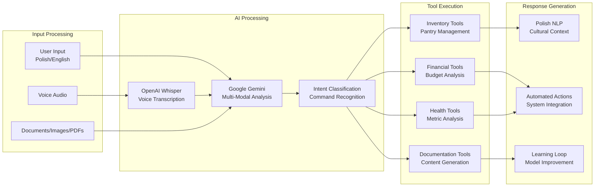
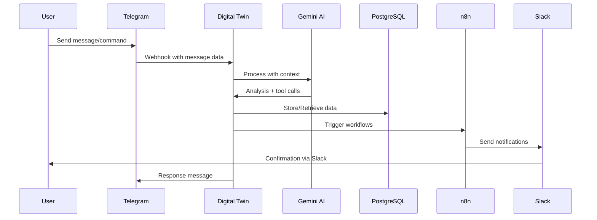

# High-Level Design Document

## Executive Summary

The Autonomous Living ecosystem is a sophisticated personal automation platform designed to eliminate manual decision-making and optimize daily life operations through intelligent data collection, AI-driven decision making, and automated execution across 12 interconnected life domains.

## 🎯 **System Vision & Architecture Principles**

### **Core Vision**
*"By end of 2026, ordinary life operations run with minimal manual work, backed by automation, observability, recoverability, and security."*

### **Architectural Principles**
1. **Data-First Decision Making:** All decisions based on quantitative data and trends
2. **AI-Enhanced Intelligence:** Human-in-the-loop AI for complex decision optimization
3. **Event-Driven Automation:** Real-time responses to life events and triggers
4. **Observability by Design:** Every system monitored, measured, and optimized
5. **Privacy-First Security:** Personal data protected with enterprise-grade controls
6. **Progressive Autonomy:** Gradual transition from automation to autonomous operation

---

## 🏗️ **SYSTEM ARCHITECTURE OVERVIEW**

### **Five-Layer Architecture**

#### **Layer 1: Interface & Communication**
**Purpose:** Human-system interaction and multi-channel communication
**Components:**
- Telegram Bot (AndrzejSmartBot) - Primary communication interface
- Digital Twin REST API (FastAPI) - Programmatic state access (Port 5677)
- Webhook API - External system integration
- Grafana Dashboards - Visual analytics and monitoring

#### **Layer 2: Intelligence & Orchestration**
**Purpose:** AI processing, workflow orchestration, and decision coordination
**Components:**
- Digital Twin Hub (G04) - Central intelligence aggregator and state engine
- Google Gemini AI - Natural language processing and analysis
- n8n Workflow Engine - Visual workflow orchestration platform
- Intent Classification Router - Intelligent request routing

#### **Layer 3: Domain Systems**
**Purpose:** Specialized automation for life domains
**Production Systems:**
- G01 Training System - Health optimization through body fat tracking
- G03 Pantry Management - AI-powered household inventory management
- G05 Financial Command - Autonomous budgeting and expense tracking
- G07 Health Integration - Biometric data collection and analysis

#### **Layer 4: Data Integration & Storage**
**Purpose:** Unified data management and cross-system correlation
**Components:**
- PostgreSQL Database - Partitioned financial and operational data
- Google Sheets Integration - User-friendly data entry interface
- GitHub Repository - Version-controlled documentation and configuration
- Digital Twin Data Lake - Cross-domain temporal data storage

#### **Layer 5: Infrastructure & Observability**
**Purpose:** Reliable execution platform with comprehensive monitoring
**Components:**
- Docker Container Platform - Service orchestration and isolation
- Prometheus Metrics Collection - Real-time performance monitoring
- Grafana Visualization - Operational intelligence dashboards
- Automated Backup & Recovery - Data protection and system resilience

---

## 🧠 **INTELLIGENCE ARCHITECTURE**

### **AI-Powered Decision Making**

#### **Digital Twin Intelligence Hub**
The G04 Digital Twin serves as the central nervous system, providing:
- **Context Awareness:** Aggregates data from all systems for unified situational understanding
- **Predictive Insights:** Uses historical patterns to forecast needs and optimize resource allocation
- **Cross-Domain Intelligence:** Correlates health, financial, and productivity data for holistic optimization

#### **Natural Language Processing Stack**


---

## 🔄 **DATA FLOW ARCHITECTURE**

### **Event-Driven Data Pipeline**

#### **Real-Time Processing**


#### **Scheduled Data Synchronization**
```mermaid
gantt
    title Daily Data Sync Schedule
    dateFormat X
    axisFormat %s
    
    section Health Data
    Withings Sync      :every 2h: 0, 7200, 14400, 21600, 43200, 50400, 57600
    G01 Training Sync :every 6h: 0, 21600, 43200
    
    section Financial Data
    Budget Alerts      :daily at 8am: 28800
    Transaction Import :every 4h: 0, 14400, 28800, 43200
    
    section Digital Twin
    Data Ingestion    :every 8h: 0, 28800, 57600
    Status Reports    :daily at 9am: 32400
```

---

## 🏛️ **DOMAIN SYSTEM ARCHITECTURE**

### **Four Foundation Systems (Enablement Layer)**

#### **G04 Digital Twin Ecosystem** ✅ **PRODUCTION READY**
- **Role:** Central intelligence hub and data aggregator
- **Integration Point:** All systems connect through Digital Twin for context sharing
- **Key Capability:** Multi-channel communication with AI-powered decision making and REST state access
- **Impact:** Enables cross-domain optimization and intelligent coordination

#### **G05 Financial Command Center** ✅ **PRODUCTION READY**
- **Role:** Resource allocation and budget automation
- **Integration Point:** Provides financial context to all other systems
- **Key Capability:** Real-time budget monitoring with intelligent alerts
- **Impact:** Enables resource-aware decision making across all life domains

#### **G10 Intelligent Productivity & Time Architecture** 🟡 **WORKING PROTOTYPE**
- **Role:** Time optimization and intelligent scheduling
- **Integration Point:** Optimizes resource allocation across all systems
- **Key Capability:** Automated daily note preparation and task injection
- **Impact:** Enables data-driven daily focus and reclaimed time

#### **G12 Meta-System Integration** ✅ **PRODUCTION READY**
- **Role:** System orchestration and continuous optimization
- **Integration Point:** Monitors and coordinates all foundation systems
- **Key Capability:** Automated documentation compliance auditing and hub-to-API integration
- **Impact:** Ensures structural integrity and cross-system connectivity

### **Eight Growth Systems (Application Layer)**

#### **Currently Production-Ready (6/8):**
- **G01 Training System:** Health optimization through biometric tracking
- **G03 Pantry Management:** AI-powered household operations
- **G07 Health Integration:** Comprehensive biometric data collection
- **G02 Automationbro:** Content generation (partial)
- **G09 Documentation:** Knowledge capture system (partial)

#### **Documentation Only (2/8):**
- **G06 Certification Exams:** Professional development tracking
- **G08 Smart Home:** IoT integration and automation
- **G10 Career Intelligence:** Professional positioning system

---

## 📊 **INTEGRATION STRATEGY**

### **Hub-and-Spoke Integration Pattern**
The Digital Twin (G04) serves as the central hub, with domain systems as spokes:

#### **Data Integration Patterns**
1. **Health-Finance Loop:** Health metrics influence resource allocation
2. **Productivity-Health Loop:** Energy levels drive scheduling optimization
3. **Household-Finance Loop:** Inventory impacts budget planning
4. **Documentation-Content Loop:** System learning feeds brand building

#### **Integration Quality Levels**
- **Level 4 (Autonomous):** G04-G05, G04-G01, G04-G07 - Fully automated data exchange
- **Level 3 (Assisted):** G04-G03, G04-G12 - AI-enhanced with human oversight
- **Level 2 (Coordinated):** G04-G02, G04-G09 - Automated triggers with manual processing
- **Level 1 (Independent):** G06, G08, G10 - Manual operation with data collection only

---

## 🔒 **SECURITY ARCHITECTURE**

### **Defense-in-Depth Security Model**

#### **Layer 1: Identity & Access Management**
- **Authentication:** OAuth 2.0, API Keys, Bot Tokens
- **Authorization:** Role-based access control with least privilege
- **Credential Management:** Encrypted storage with automatic rotation

#### **Layer 2: Network & Infrastructure Security**
- **Container Isolation:** Docker networks with controlled communication
- **API Protection:** Rate limiting, input validation, request signing
- **Data Transit Encryption:** TLS 1.3 for all external communications

#### **Layer 3: Data Protection**
- **Encryption at Rest:** PostgreSQL encryption, encrypted backups
- **Privacy Controls:** Personal data anonymization, GDPR compliance
- **Audit Trail:** Comprehensive logging with tamper protection

#### **Layer 4: Operational Security**
- **Supply Chain Security:** Container image scanning, dependency updates
- **Vulnerability Management:** Regular security assessments and patching
- **Incident Response:** Automated threat detection and response procedures

---

## 📈 **SCALABILITY ARCHITECTURE**

### **Horizontal Scaling Strategy**

#### **Service Scaling**
- **Stateless Services:** n8n workflows and API endpoints scale horizontally
- **Database Scaling:** PostgreSQL partitioning + read replicas for analytics
- **Caching Layer:** Redis for frequent queries and session management
- **Load Balancing:** nginx reverse proxy with health checks

#### **Data Scaling**
- **Time Series Partitioning:** Automated yearly partitioning for transaction data
- **Data Archival:** Cold storage for historical data beyond 5 years
- **Analytics Optimization:** Materialized views for complex queries
- **Backup Strategy:** Incremental backups with point-in-time recovery

---

## 🔧 **OBSERVABILITY ARCHITECTURE**

### **Four-Pillar Monitoring Model**

#### **Pillar 1: Metrics (What's Happening?)**
- **Infrastructure Metrics:** CPU, memory, disk, network utilization
- **Application Metrics:** Response times, error rates, throughput
- **Business Metrics:** Goal progress, budget compliance, health trends
- **Custom Metrics:** 15+ domain-specific metrics collectors

#### **Pillar 2: Logs (Why is it Happening?)**
- **Structured Logging:** JSON format with correlation IDs
- **Log Aggregation:** Centralized log collection and indexing
- **Error Tracking:** Exception stack traces and error context
- **Audit Logs:** Security events and data access tracking

#### **Pillar 3: Tracing (Where is it Happening?)**
- **Distributed Tracing:** Request flow across microservices
- **Performance Tracing:** Database query optimization
- **User Journey Tracking:** End-to-end user interaction flows
- **System Dependency Mapping:** Service interaction analysis

#### **Pillar 4: Alerting (What Should I Do?)**
- **Threshold Alerts:** Budget breaches, system downtime, health anomalies
- **Anomaly Detection:** Statistical outlier identification
- **Predictive Alerts:** Trend-based early warning system
- **Escalation Procedures:** Multi-channel alert routing

---

## 🚀 **EVOLUTION ROADMAP**

### **Phase 1: Foundation Consolidation (Q1-Q2 2026)**
**Objective:** Complete foundation systems and integration maturity

**Key Deliverables:**
- Implement G11 Time Architecture with energy-aware scheduling
- Complete G04 placeholder webhooks for full AI capabilities
- Enhance G12 meta-system integration with automated optimization
- Strengthen cross-system data flows for real-time coordination

**Success Criteria:**
- All foundation systems (G04, G05, G11, G12) fully operational
- 80%+ of system interactions automated
- <2-minute response time for cross-system queries
- 99.9% uptime across critical services

### **Phase 2: Intelligence Enhancement (H2 2026)**
**Objective:** Advanced AI capabilities and predictive automation

**Key Deliverables:**
- Implement machine learning models for predictive health optimization
- Add advanced natural language processing for Polish linguistic nuance
- Create autonomous decision-making capabilities with minimal human intervention
- Develop reinforcement learning for system optimization

**Success Criteria:**
- Predictive accuracy >85% for health and financial forecasting
- 50% reduction in manual decision-making
- Autonomous operation for routine tasks
- Continuous learning and adaptation

### **Phase 3: Ecosystem Expansion (2027+)**
**Objective:** Full autonomous living with external integrations

**Key Deliverables:**
- Smart home integration (G08) with IoT ecosystem
- Career intelligence automation (G10) with professional network integration
- External service integrations (banking, healthcare, education)
- Mobile application for comprehensive system management

**Success Criteria:**
- 90%+ of daily operations fully automated
- Real-time bi-directional integration with external services
- Proactive system optimization with minimal human oversight
- Scalable platform supporting additional life domains

---

## 🎯 **SUCCESS METRICS & KPIs**

### **System Performance KPIs**
- **Autonomy Ratio:** Percentage of tasks executed without human intervention (Target: 85%)
- **Response Latency:** Average time from trigger to system response (Target: <2 seconds)
- **Integration Coverage:** Percentage of systems with active data flows (Target: 90%)
- **Decision Accuracy:** Percentage of AI recommendations that improve outcomes (Target: 80%)

### **Life Impact KPIs**
- **Time Reclaimed:** Hours saved weekly through automation (Target: 10+ hours/week)
- **Decision Quality:** Reduction in suboptimal choices (Target: 60% improvement)
- **Health Optimization:** Improvement in biometric indicators (Target: Measurable gains)
- **Financial Efficiency:** Reduction in unnecessary expenses (Target: 20% improvement)

### **Technical Excellence KPIs**
- **System Reliability:** Uptime percentage across critical services (Target: 99.9%)
- **Data Accuracy:** Consistency across synchronized systems (Target: 99.5%)
- **Security Compliance:** Number of security incidents (Target: 0 critical incidents)
- **Scalability:** Ability to handle 2x current load without degradation

---

## 🏁 **CONCLUSION**

The Autonomous Living high-level design represents a comprehensive approach to personal life automation through intelligent systems integration. The architecture balances immediate practical utility with long-term autonomy goals, providing a scalable foundation for continuous enhancement.

### **Key Architectural Strengths:**
1. **Modular Design:** Clear separation of concerns with well-defined interfaces
2. **Integration-First:** Systems designed for data sharing and coordination
3. **AI-Enhanced:** Human-in-the-loop AI with continuous learning
4. **Production-Ready:** Enterprise-grade reliability, security, and observability
5. **Evolutionary:** Designed for progressive enhancement and expansion

### **Strategic Differentiator:**
The combination of **comprehensive data integration** with **AI-driven decision making** creates a unique personal automation platform that goes beyond simple task automation to provide genuine life optimization and autonomous operation.

---

*Last updated: 2026-02-19*