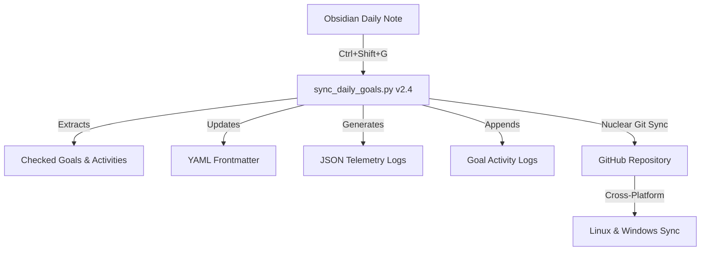

# Daily Goals Automation System

**Version:** 2.4 (Cross-Platform Production)  
**Status:** Production Ready  
**Platforms:** Linux, Windows  
**Purpose:** Automated bridge between Obsidian Second Brain and autonomous-living execution repository

## System Overview

The Daily Goals Automation System transforms your Obsidian daily notes into structured execution data, maintaining perfect synchronization across all your devices while embodying your "Automation-First Living" philosophy.

### Architecture at a Glance



### Core Capabilities

*   🤖 **Automation-First Design:**
    *   Zero manual Git operations required
    *   Self-healing conflict resolution
    *   Cross-platform path auto-detection
    *   Production-grade error handling

*   📊 **Structured Data Generation:**
    *   JSON telemetry for analytics and AI processing
    *   Markdown activity logs for human review
    *   YAML frontmatter for Obsidian integration
    *   Automatic backup creation

*   🌍 **Cross-Platform Reliability:**
    *   Identical operation on Linux and Windows
    *   Unicode/emoji support on all platforms
    *   Relative path architecture eliminates configuration drift
    *   Nuclear conflict resolution prevents Git issues

## Quick Start
### Prerequisites

*   **Python 3.8+** with `PyYAML` module
*   **Git** configured with GitHub access
*   **Obsidian** installed
*   **Shell Commands** plugin for Obsidian (recommended)

### Folder Structure (Critical)

```
Documents/
├── Obsidian Vault/           # Your Second Brain
│   └── 99_System/scripts/    # Automation scripts location
└── autonomous-living/        # Your execution repository (this repo)
```

### Daily Usage

1.  Fill daily note: Check goals you worked on, add "Did:" descriptions
2.  Trigger automation: Press `Ctrl+Shift+G` in Obsidian
3.  Verification: See success message, check created files
4.  Result: Perfect cross-platform synchronization automatically maintained

## System Components
### Input: Daily Note Format

```markdown
## After Work – Power Goals

- [x] **G02** – [[P - Automation - Automationbro]]
    - **Did:** Published automation best practices article
    - **Next:** Create follow-up on AI integration patterns  
    - **Code:** `autonomous-living/goal-g02/articles/`
```

### Output: Structured Data

**YAML Frontmatter:**
```yaml
goals_touched: ["[[P - Automation - Automationbro]]"]
goals_activities:
  G02:
    name: "P - Automation - Automationbro"
    did: "Published automation best practices article"
    next: "Create follow-up on AI integration patterns"
    code: "autonomous-living/goal-g02/articles/"
```

**JSON Telemetry:**
```json
{
  "date": "2026-01-18",
  "goals_summary": {"total_touched": 1},
  "activities": [{"id": "G02", "did": "Published...", "next": "Create..."}]
}
```

**Activity Log:**
```markdown
## 2026-01-18 (Saturday)

**Action:** Published automation best practices article
**Next Step:** Create follow-up on AI integration patterns
**Code:** `autonomous-living/goal-g02/articles/`
```

### Configuration

**Location:** `Obsidian Vault/99_System/scripts/config.yaml`

```yaml
# Minimal configuration - paths auto-detected
daily_notes_folder: "01_Daily_Notes"
create_backups: true
verbose_logging: true
auto_git_sync: true
```

### Obsidian Integration

**Shell Commands Setup:**
*   Command (Linux): `python3 "{{vault_path}}/99_System/scripts/sync_daily_goals.py" --force`
*   Command (Windows): `python "{{vault_path}}\99_System\scripts\sync_daily_goals.py" --force`
*   Working Directory: (leave empty)
*   Hotkey: `Ctrl+Shift+G`

### Nuclear-Proof Git Strategy

The system uses a fetch-reset strategy that eliminates merge conflicts:
1.  Fetch: Get latest remote state from other machines
2.  Reset: Align local Git history with remote (preserving generated files)
3.  Stage: Add newly created JSON and Markdown files
4.  Commit: Create clean commit on top of remote history
5.  Push: Send to GitHub with zero conflicts

Result: Both Linux and Windows can write simultaneously without conflicts.

### File Locations
**Generated Files**
```
autonomous-living/
├── _meta/
│   ├── daily-logs/YYYY-MM-DD.json     # Machine-readable telemetry
│   └── backups/YYYY-MM-DD.md.bak      # Safety backups
├── goal-g01/ACTIVITY.md                # Goal-specific activity logs
├── goal-g02/ACTIVITY.md
└── goal-g12/ACTIVITY.md
```

**Script Location**
```
Obsidian Vault/
└── 99_System/scripts/
    ├── sync_daily_goals.py             # Main automation engine
    └── config.yaml                     # Configuration file
```

### Quick Diagnostics

Test the system:
```bash
# Linux
cd "Obsidian Vault/99_System/scripts"
python3 sync_daily_goals.py --verbose --force

# Windows
cd "Obsidian Vault\99_System\scripts"
python sync_daily_goals.py --verbose --force
```
Expected output: Version information and system details

Verify results:
```bash
# Check JSON logs
ls -la autonomous-living/_meta/daily-logs/

# Check activity logs
ls -la autonomous-living/goal-g*/ACTIVITY.md

# Check Git sync
cd autonomous-living && git status
```

## Related Documentation

*   Installation Guide - Complete setup from scratch
*   Troubleshooting Guide - Common issues and recovery
*   Git Operations Reference - Manual commands for maintenance
*   Architecture Deep Dive - Technical implementation details
*   [WF003: SVC_Response-Dispatcher](../../50_AUTOMATIONS/n8n/workflows/WF003__svc-response-dispatcher.md)

## Emergency Recovery

If automation fails:
```bash
cd autonomous-living
git fetch origin
git reset --hard origin/main  # Nuclear reset to match GitHub
```

If repository corrupted:
```bash
cd Documents
rm -rf autonomous-living
git clone {{EMAIL}}:yourusername/autonomous-living.git
```

## Support

Before requesting help, run diagnostics:
```bash
python3 sync_daily_goals.py --verbose --force 2>&1 | tee debug.log
```
Submit issues with:
*   `debug.log` file
*   Operating system details
*   Git repository status
*   Daily note format sample

This system embodies "Automation-First Living" principles by eliminating manual overhead while maintaining perfect data integrity and cross-platform synchronization. It serves as the foundational infrastructure for your 2026 vision of complete life automation.

## Procedure
1. **Daily:** Trigger via Ctrl+Shift+G hotkey
2. **Weekly:** Check Git sync status
3. **Monthly:** Review activity logs
4. **Quarterly:** Review automation effectiveness

## Failure Modes
| Scenario | Detection | Response |
|----------|-----------|----------|
| Script fails | Error message in output | Check daily note format |
| Git conflict | Merge conflict message | Run with --force flag |
| Missing data | Empty activity log | Verify goals checked in note |

## Security Notes
- No credentials in script
- Git tokens stored in system keychain
- Daily notes contain personal data

## Owner & Review
- **Owner:** Michał
- **Review Cadence:** Monthly
- **Last Updated:** 2026-02-16