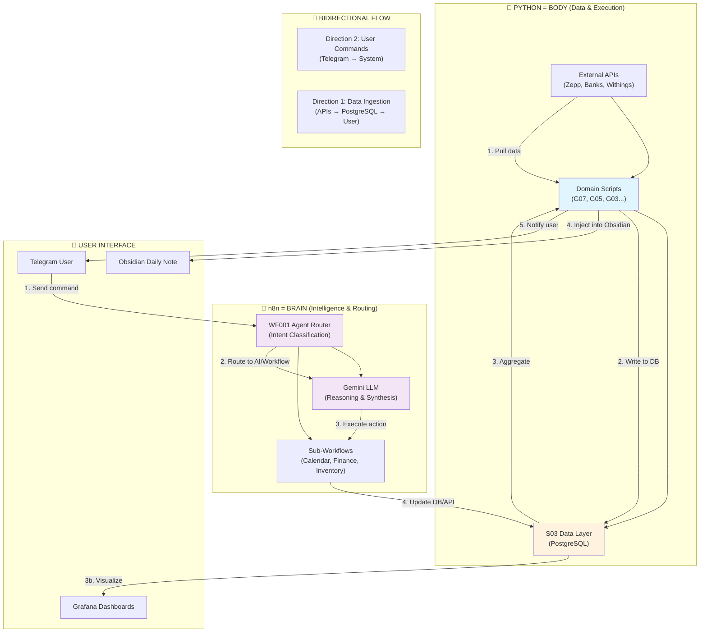
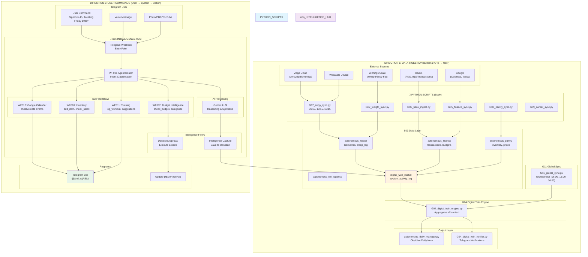
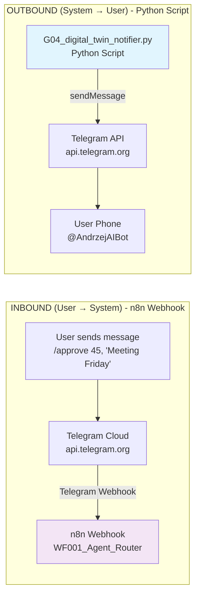
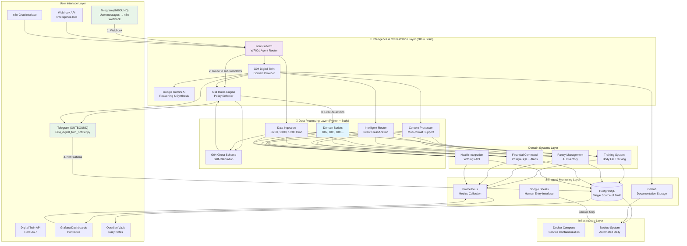
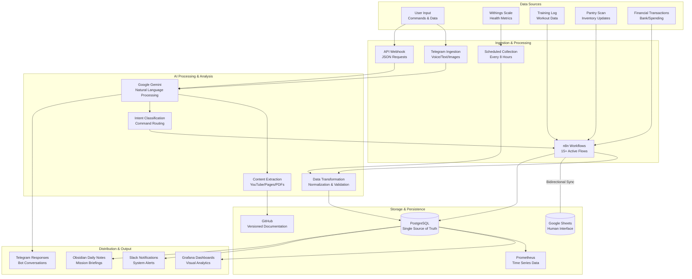
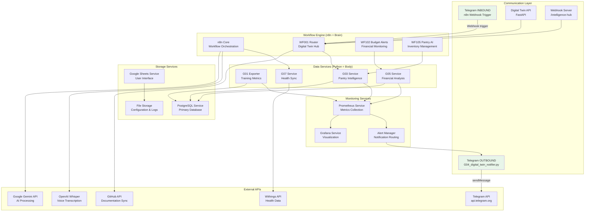
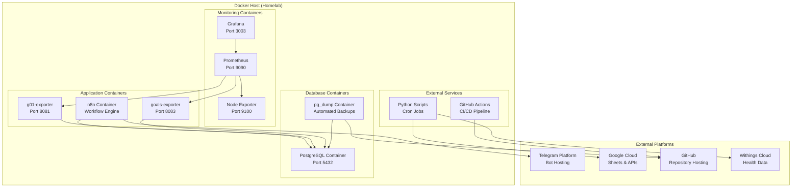
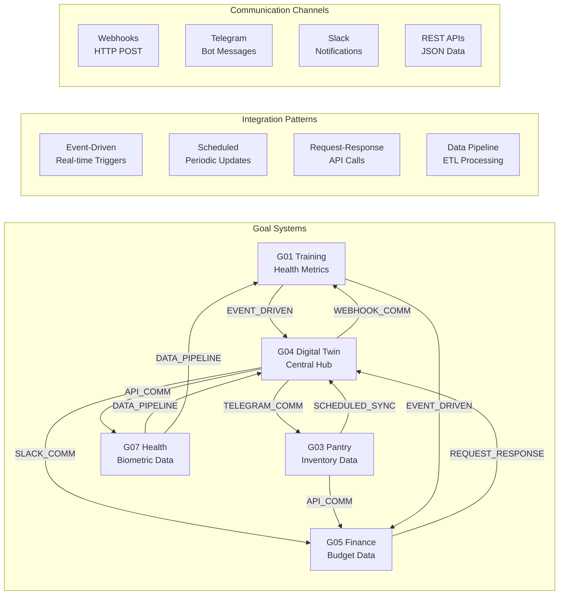
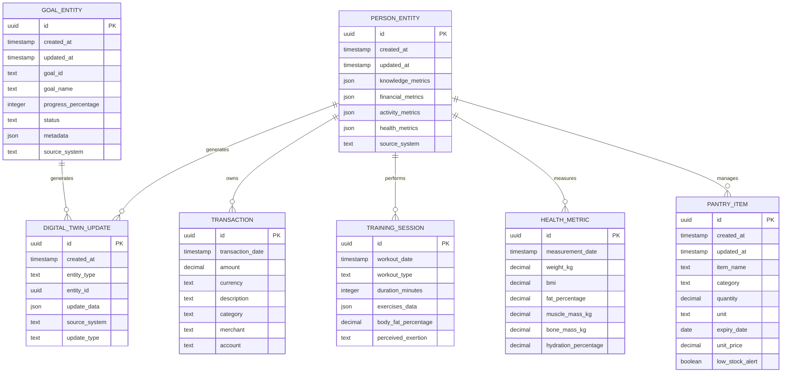
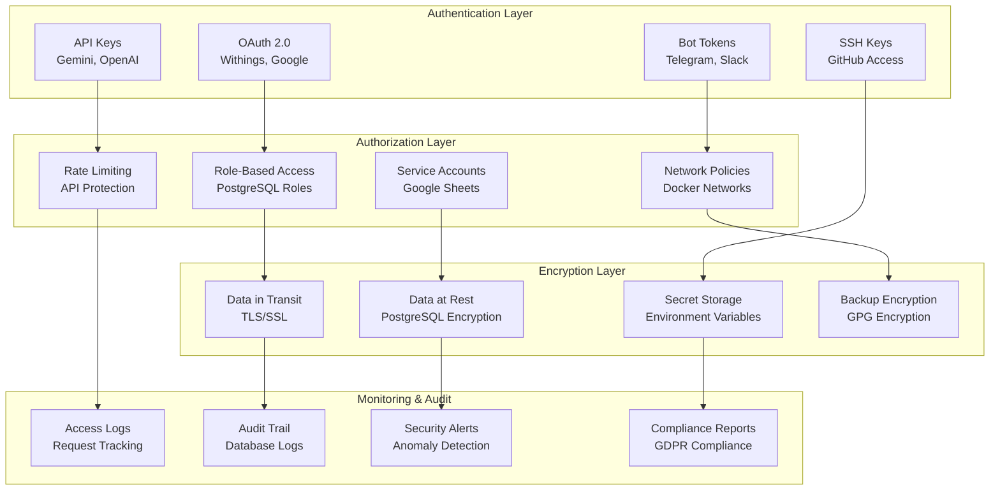

# Autonomous Living Architecture Diagrams

## Overview

This document contains high-level and low-level architectural diagrams for the autonomous-living ecosystem as of 2026-04-08.

---

## 🎯 **CORE ARCHITECTURAL PATTERN: Python = Body, n8n = Brain**

This is the fundamental design principle governing all system architecture:

### Pattern Rules

| Rule | Python (Body) | n8n (Brain) |
|------|---------------|--------------|
| **Responsibility** | Data ingestion, DB writes, calculations | Intent classification, AI reasoning, routing |
| **Triggers** | Cron schedules (06:00, 13:00, 16:00) | User input (Telegram, webhooks) |
| **Failure Mode** | Deterministic fallback | "Wait for n8n" state |
| **Examples** | `G07_zepp_sync.py`, `G05_finance_sync.py` | `WF001_Agent_Router`, `WF012_Calendar` |

> [!important]
> **Key Principle:** All LLM-based reasoning (Gemini) is strictly handled by n8n. Python scripts act as deterministic data providers and executors.

---

## 🔄 **BIDIRECTIONAL DATA FLOW ARCHITECTURE** *(NEW 2026-04-08)*

This diagram replaces the legacy DATA FLOW ARCHITECTURE (marked ⚠️ below).

---

## 📱 **TELEGRAM BOT ARCHITECTURE**

The Telegram bot has two separate data flows:

### Telegram Architecture Notes

| Direction | Component | Status | Reason |
|-----------|-----------|--------|--------|
| **INBOUND** | Python polling bot (`G04_telegram_bot.py`) | ❌ Deprecated (2026-04-08) | 409 Conflict with n8n webhook |
| **INBOUND** | n8n Telegram Webhook | ✅ Active | WF001_Agent_Router receives all user input |
| **OUTBOUND** | `G04_digital_twin_notifier.py` | ✅ Active | Sends all notifications, CEO briefings, alerts |

> [!note]
> **Current Setup:** 
> - Inbound messages → n8n (via webhook)
> - Outbound notifications → Python script (via Telegram API)
> - Both use the same Telegram Bot token (`TELEGRAM_BOT_TOKEN`)

---

## 🏗️ **HIGH-LEVEL SYSTEM ARCHITECTURE**

## 🔄 **DATA FLOW ARCHITECTURE** (Legacy - See Bidirectional Flow Above)

## 🏛️ **SYSTEM COMPONENT ARCHITECTURE**

## 🐳 **DEPLOYMENT ARCHITECTURE**

## 🔗 **INTEGRATION ARCHITECTURE**

## 📊 **DATA ARCHITECTURE**

## 🔐 **SECURITY ARCHITECTURE**

---

## 📋 **DIAGRAM LEGEND**

### **Component Types**
- **Rectangles (Blue 🟦):** Python Scripts (Body) - Data & Execution
- **Rectangles (Purple 🟪):** n8n Workflows (Brain) - Intelligence & Routing
- **Cylinders (Orange 🟧):** PostgreSQL Databases (Data Layer)
- **Hexagons:** External APIs/Services
- **Circles (Green 🟩):** User Interface (Telegram, Obsidian)

### **Color Coding**
- 🟦 **Light Blue:** Python Scripts (Deterministic execution)
- 🟪 **Light Purple:** n8n Workflows (AI intelligence)
- 🟧 **Light Orange:** PostgreSQL (Data persistence)
- 🟩 **Light Green:** User Interface (Telegram, Obsidian)

### **Architecture Pattern**
- **🐍 Python = Body:** Pulls data from external APIs, writes to PostgreSQL, generates daily notes
- **🧠 n8n = Brain:** Receives user input, classifies intent, routes to sub-workflows, triggers AI processing

### **Connection Types**
- **Solid Arrows:** Direct data flow/synchronous calls
- **Dashed Arrows:** Event-driven/asynchronous communication
- **Double Arrows:** Bidirectional communication
- **Dotted Lines:** Potential/Planned connections

---

### **Telegram Architecture Note**
- **Inbound (User → System):** Via n8n Webhook → WF001 Agent Router
- **Outbound (System → User):** Via Python (`G04_digital_twin_notifier.py`) → Telegram API

---

*Core Architecture Pattern documented: 2026-04-08*
*Bidirectional Flow Architecture documented: 2026-04-08*
*Telegram split architecture documented: 2026-04-08*