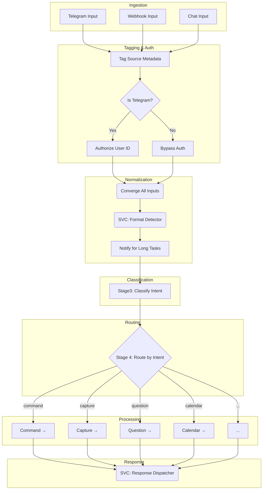

```mermaid
graph TD
    subgraph Ingestion
        A[Telegram Input]
        B[Webhook Input]
        C[Chat Input]
    end

    subgraph Tagging & Auth
        D[Tag Source Metadata]
        E{Is Telegram?}
        F[Authorize User ID]
        G[Bypass Auth]
    end

    subgraph Normalization
        H(Converge All Inputs)
        I(SVC: Format Detector)
        J[Notify for Long Tasks]
    end

    subgraph Classification
        K[Stage3: Classify Intent]
    end

    subgraph Routing
        L{Stage 4: Route by Intent}
    end

    subgraph Processing
        M[Command →]
        N[Capture →]
        O[Question →]
        P[Calendar →]
        Q[...]
    end

    subgraph Response
        R(SVC: Response Dispatcher)
    end

    A --> D
    B --> D
    C --> D
    D --> E
    E -- Yes --> F
    E -- No --> G
    F --> H
    G --> H
    H --> I
    I --> J
    J --> K
    K --> L

    L -- command --> M
    L -- capture --> N
    L -- question --> O
    L -- calendar --> P
    L -- ... --> Q

    M --> R
    N --> R
    O --> R
    P --> R
    Q --> R
```
