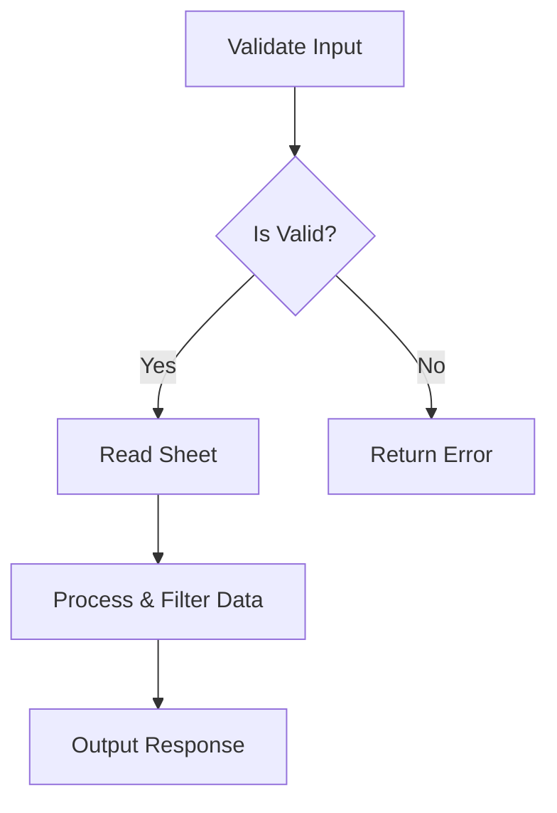

# SVC001: Google Sheets Reader

## Purpose
Generic, reusable n8n sub-workflow service that reads data from any Google Sheet, applies optional filters, and returns normalized structured output for use by other workflows.

## Triggers
- None (sub-workflow only)
- Called via `Execute Workflow` node from parent workflows
- No direct execution - always invoked by another workflow

## Inputs

### Required Parameters
| Parameter | Type | Description | Example |
|-----------|------|-------------|---------|
| `sheet_id` | string | Google Sheet document ID | "1ABC123xyz..." |

### Optional Parameters
| Parameter | Type | Default | Description | Example |
|-----------|------|---------|-------------|---------|
| `sheet_name` | string | "Sheet1" | Name of the tab/sheet to read | "Inventory" |
| `range` | string | "A:Z" | Column range to read | "A:F" |
| `filters` | object | `null` | Filter configuration | See below |
| `options` | object | `{}` | Processing options | See below |

### Filter Object Structure
```json
{
  "column": "Category",
  "value": "Dairy",
  "operator": "equals"
}
```

Available Filter Operators
| Operator | Description | Use Case |
|---|---|---|
| `equals` | Exact match (case insensitive) | Category filtering |
| `contains` | Partial string match | Search by keyword |
| `starts_with` | String prefix match | Code/ID lookups |
| `ends_with` | String suffix match | File type filtering |
| `greater_than` | Numeric comparison | Quantity thresholds |
| `less_than` | Numeric comparison | Low stock detection |
| `not_equals` | Exclusion filter | Skip categories |

Options Object Structure

```json
{
  "include_empty": false,
  "limit": 100,
  "skip_header": true
}
```

Full Input Example

```json
{
  "sheet_id": "1ABC123xyz...",
  "sheet_name": "Pantry",
  "range": "A:F",
  "filters": {
    "column": "Category",
    "value": "Dairy",
    "operator": "equals"
  },
  "options": {
    "include_empty": false,
    "limit": 100
  }
}
```

Processing Logic

1.  Validate Input
    *   Check for required `sheet_id` parameter
    *   Apply defaults for optional parameters
    *   Return error response if validation fails
2.  Read Google Sheet
    *   Connect to Google Sheets API
    *   Fetch data from specified sheet and range
    *   Handle API errors gracefully
3.  Process & Filter Data
    *   Apply column filters if specified
    *   Remove empty rows (unless `include_empty: true`)
    *   Apply row limit
    *   Extract column names from first row
4.  Return Normalized Output
    *   Success/failure status
    *   Processed data array
    *   Metadata about the operation

## Outputs
Success Response

```json
{
  "success": true,
  "data": [
    {
      "Item": "Milk",
      "Category": "Dairy",
      "Quantity": 3,
      "Unit": "L",
      "Min_Threshold": 2,
      "Last_Updated": "2026-02-07"
    },
    {
      "Item": "Eggs",
      "Category": "Dairy",
      "Quantity": 12,
      "Unit": "pcs",
      "Min_Threshold": 6,
      "Last_Updated": "2026-02-06"
    }
  ],
  "meta": {
    "total_rows": 25,
    "filtered_rows": 2,
    "columns": ["Item", "Category", "Quantity", "Unit", "Min_Threshold", "Last_Updated"],
    "sheet_name": "Pantry",
    "sheet_id": "1ABC123xyz...",
    "filters_applied": true,
    "timestamp": "2026-02-07T12:00:00.000Z"
  }
}
```

Error Response

```json
{
  "success": false,
  "error": "Missing required parameter: sheet_id",
  "data": [],
  "meta": {
    "timestamp": "2026-02-07T12:00:00.000Z"
  }
}
```

### Output Fields Reference
| Field | Type | Description |
|---|---|---|
| `success` | boolean | Whether operation completed successfully |
| `data` | array | Array of row objects (empty if error) |
| `error` | string | Error message (only present if `success: false`) |
| `meta.total_rows` | number | Total rows read from sheet |
| `meta.filtered_rows` | number | Rows remaining after filtering |
| `meta.columns` | array | List of column names |
| `meta.sheet_name` | string | Name of sheet read |
| `meta.sheet_id` | string | Document ID |
| `meta.filters_applied` | boolean | Whether filters were applied |
| `meta.timestamp` | string | ISO timestamp of operation |

## Dependencies
### Systems

*   S03 Data Layer

### External Services

*   Google Sheets API (OAuth2 authentication)

### Credentials

*   Google Sheets OAuth2 API credentials (configured in n8n)
*   Credential ID: YOUR_GOOGLE_SHEETS_CREDENTIAL_ID (update after import)

### Required Permissions

*   `https://www.googleapis.com/auth/spreadsheets.readonly` (minimum)
*   `https://www.googleapis.com/auth/spreadsheets` (if write access needed in future)

## Error Handling
| Failure Scenario | Detection | Response | Alert |
|---|---|---|---|
| Missing `sheet_id` | Validation check | Return error response with message | None (caller handles) |
| Invalid sheet ID | Google API 404 | Return error with API message | None (caller handles) |
| Permission denied | Google API 403 | Return error with access denied message | None (caller handles) |
| Sheet not found | Google API error | Return error with sheet name | None (caller handles) |
| API rate limit | Google API 429 | Return error, suggest retry | None (caller handles) |
| Network timeout | Request timeout | Return error with timeout message | None (caller handles) |

## Monitoring

*   Success metric: `success: true` in response
*   Caller responsibility: Parent workflow should log/alert on failures
*   No internal alerting: This is a service, not a triggered workflow

## Manual Fallback

If service fails repeatedly:

*   Verify credentials:

    `n8n > Credentials > Google Sheets OAuth2`
    Test connection

*   Check sheet access:
    *   Open sheet in browser
    *   Verify sharing settings
    *   Confirm service account has access

*   Test manually:

    Open n8n workflow: `SVC_Google-Sheets-Reader`
    Pin test data to first node:
    ```json
    {
      "sheet_id": "your-sheet-id",
      "sheet_name": "Sheet1"
    }
    ```
    Execute workflow manually

*   Direct API test:

    ```bash
    # Using gcloud CLI
    gcloud auth login
    curl "https://sheets.googleapis.com/v4/spreadsheets/{SHEET_ID}/values/{RANGE}" \
      -H "Authorization: Bearer $(gcloud auth print-access-token)"
    ```

## Usage Examples
### Example 1: Read All Inventory

```json
{
  "sheet_id": "1ABC123xyz...",
  "sheet_name": "Pantry"
}
```

### Example 2: Get Items by Category

```json
{
  "sheet_id": "1ABC123xyz...",
  "sheet_name": "Pantry",
  "filters": {
    "column": "Category",
    "value": "Vegetables",
    "operator": "equals"
  }
}
```

### Example 3: Find Low Stock Items

```json
{
  "sheet_id": "1ABC123xyz...",
  "sheet_name": "Pantry",
  "filters": {
    "column": "Quantity",
    "value": "5",
    "operator": "less_than"
  }
}
```

### Example 4: Search Items by Name

```json
{
  "sheet_id": "1ABC123xyz...",
  "sheet_name": "Pantry",
  "filters": {
    "column": "Item",
    "value": "milk",
    "operator": "contains"
  }
}
```

### Example 5: Limited Results

```json
{
  "sheet_id": "1ABC123xyz...",
  "sheet_name": "Pantry",
  "options": {
    "limit": 10
  }
}
```

## Calling This Service
### From n8n Workflow (Execute Workflow Node)

Node: `Execute Workflow`
*   Workflow: `SVC_Google-Sheets-Reader`
*   Mode: `Wait for sub-workflow to complete`
*   Input: (pass JSON as shown in examples)

### Processing the Response

```javascript
// In Code node after Execute Workflow
const result = $input.first().json;

if (result.success) {
  const items = result.data;
  const count = result.meta.filtered_rows;
  // Process items...
} else {
  const error = result.error;
  // Handle error...
}
```

## Workflow Structure



## Related Documentation

*   Parent Goal: G03: Autonomous Household Operations
*   System: S03 Data Layer
*   Consumer: SVC002: Inventory Query
*   Consumer: PROJ: Inventory Management

## Changelog
| Date | Version | Change |
|---|---|---|
| 2026-02-07 | 1.0.0 | Initial release |

## Future Enhancements

*   Add caching layer for frequently accessed sheets
*   Support multiple filter conditions (AND/OR logic)
*   Add sorting options
*   Support named ranges
*   Add batch reading for multiple sheets
