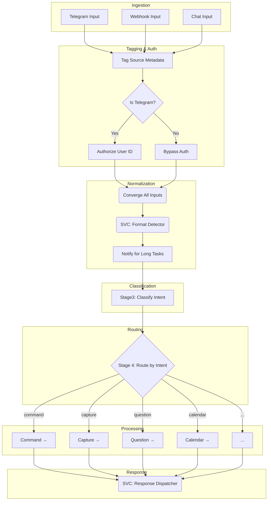

# WF001: Agent Router (Intelligence Hub)

## 1. Executive Overview

WF001, the "Intelligence Hub," is the central nervous system for all incoming data. It functions as a universal router, implementing a **hub-and-spoke architecture** to ingest, classify, and delegate tasks. It receives all multi-channel inputs (Telegram, webhooks, chat), normalizes them, determines user intent, and routes them to specialized sub-workflows for processing.

This workflow is the foundation of the Digital Twin's ability to interact with the world, bridging the gap between rigid automation and fluid AI-driven processing.

- **Workflow JSON**: `WF001_Agent_Router.json`
- **Architectural Deep-Dive**: `docs/20_SYSTEMS/S11_Intelligence_Router/README.md`

## 2. Architectural Philosophy

The router is built on four key principles:

1.  **Universal Intake**: All data, regardless of source, enters through this single workflow.
2.  **Intelligent Routing**: A multi-stage process classifies the data's format and the user's intent.
3.  **Specialized Processing**: Complex logic is delegated to isolated, single-responsibility sub-workflows (services).
4.  **Unified Response**: A centralized dispatcher formats and delivers responses tailored to the original input channel.

## 3. Stage-by-Stage Breakdown

### Stage 1: Ingestion & Source Tagging

-   **Nodes**: `Telegram Input`, `Webhook`, `When chat message received`, `Tag Telegram1`, `Tag Webhook1`, `Tag Chat1`
-   **Purpose**: Accept inputs from three channels and tag them with standardized `_router` metadata, including `trigger_source`, `user_id`, `chat_id`, and a unique `trace_id`. The original payload is always preserved.

### Stage 2: Authentication

-   **Nodes**: `Is Telegram`, `Authorized1`, `Unauthorized Reply`
-   **Purpose**: To secure the public-facing Telegram endpoint.
-   **Logic**:
    -   If the source is Telegram, the `user_id` is checked against a hardcoded allowlist (`7689674321`).
    -   If unauthorized, an "Unauthorized access" message is sent and the workflow stops.
    -   Webhook and chat inputs currently bypass this check.
-   **ADR**: The use of a hardcoded ID is documented in [ADR-0011-Hardcoded-User-ID-in-Router](./../../60_DECISIONS_ADRS/ADR-0011-Hardcoded-User-ID-in-Router.md).

### Stage 3: Format Detection & Normalization

-   **Node**: `SVC: Format Detector` (sub-workflow)
-   **Purpose**: To identify the input format (e.g., `pdf`, `youtube_url`, `voice`) and extract a processable text representation.
-   **User Experience**: For slow operations like voice transcription or PDF parsing, a "Processing..." notification is sent to the user via the `Needs to Notify` and `Send Notif1` nodes.

### Stage 4: Intent Classification

-   **Node**: `Stage3 Classify`
-   **Purpose**: To determine the user's intent based on the extracted text and input format.
-   **Logic**: A sophisticated, rule-based engine detects intent with confidence scores. It uses a hierarchy of checks:
    1.  **Callback**: Button presses from Telegram (`confidence: 1.0`).
    2.  **Command**: Messages starting with `/` (`confidence: 1.0`).
    3.  **Calendar**: Keywords and temporal patterns with enhanced **Polish language support** (e.g., `kalendarz`, `spotkanie`, `jutro o 15:00`) (`confidence: 0.95`).
    4.  **Explicit Capture**: Keywords like `save`, `note`, `zapisz` (`confidence: 0.9`).
    5.  **Implicit Capture**: Based on format (e.g., `pdf`, `youtube_url`, `voice`) (`confidence: 0.8-0.85`).
    6.  **Question**: Common question words or ending with `?` (`confidence: 0.85`).
    7.  **Task**: Action verbs like `create` or `remind` (`confidence: 0.8`).
    8.  **Greeting**: Social pleasantries (`confidence: 0.9`).
-   **ADR**: The decision to use a rule-based classifier is documented in [ADR-0012-Rule-Based-Intent-Classification](./../../60_DECISIONS_ADRS/ADR-0012-Rule-Based-Intent-Classification.md).

### Stage 5: Intent-Based Routing & Processing

-   **Node**: `Stage 4: Route by Intent` (Switch Node)
-   **Purpose**: To delegate the request to the correct processing path based on the classified intent.

#### **Command Path**

-   **Node**: `Route Command` (Switch Node)
-   **Handles**:
    -   **System**: `/start`, `/help`, `/status`.
    -   **Goals**: `/goals` (calls `SVC_GitHub-Todo-List-Extractor`).
    -   **Planning**: `/plan`, `/evening` (calls `SVC_Github-Autonomous_Evening_Planner`).
    -   **Finance**: `/finance`, `/budget` (calls `PROJ_Personal-Budget-Intelligence-System`).
    -   **Inventory**: `/inventory`, `/pantry`, `/spizarnia` (calls `SVC: Inventory Management`).
    -   **Training**: `/training`, `/workout` (calls `PROJ_Training-Intelligence-System`).
    -   **Intel**: `/intel` (calls an intelligence activator webhook).

#### **Capture Path** (The "Second Brain")

-   **Purpose**: The core intelligence analysis and storage pipeline.
-   **Process**:
    1.  `Preserve Metadata for AI`: Prepares data for the LLM.
    2.  `AI: Intelligence Analysis`: Uses Google Gemini to summarize, analyze, and extract structured data (goals, actions) from the text. The prompt includes the 12 Power Goals for context.
    3.  `Extract Intelligence`: Parses the Markdown and JSON from the AI response.
    4.  `Save to GitHub`: Commits the markdown note to the `michal-second-brain-obsidian/00_Inbox/` directory.
    5.  `Prep for Dispatcher`: Formats the final confirmation message.

#### **Calendar Path**

-   **Purpose**: Manages Google Calendar interactions.
-   **Process**:
    1.  Calls the `SVC_Google-Calendar` sub-workflow, passing the raw text query.
    2.  The service handles parsing dates (with Polish support), checking availability, and creating events.
    3.  The result is sent back through the `SVC_Response-Dispatcher`.

#### **Other Paths**

-   **Question, Task, Callback, Conversation**: These paths are currently routed to simple handlers or placeholder webhooks (e.g., `Route: LLM Chat`).

### Stage 6: Response Orchestration

-   **Node**: `SVC_Response-Dispatcher` (sub-workflow)
-   **Purpose**: To provide a single, unified way to send responses back to the user.
-   **Logic**: It inspects the `_router.trigger_source` metadata to determine the correct channel (Telegram, Webhook, Chat) and formats the `response_text` or `response_data` accordingly.

## 4. Sub-Workflows (Services)

This workflow acts as an orchestrator, calling numerous specialized services:

-   **Core Services**:
    -   [SVC_Input-Normalizer](./WF005__svc-input-normalizer.md): Normalizes input from all sources.
    -   `SVC: Format Detector`: Detects input type.
    -   `SVC_Command-Handler`: Processes `/command` requests.
    -   [WF002: SVC_Command-Handler](./WF002__svc-command-handler.md): Centralized command orchestration.
    -   `SVC_Response-Dispatcher`: Sends all final responses.
    -   [WF003: SVC_Response-Dispatcher](./WF003__svc-response-dispatcher.md): Centralized response delivery.
-   **Domain Services**:
    -   [SVC_GitHub-Todo-List-Extractor](./WF014__svc-github-todo-list-extractor.md): Fetches goal summaries.
    -   [SVC_Github-Autonomous_Evening_Planner](./WF013__svc-github-autonomous-evening-planner.md): Runs the evening planning routine.
    -   [SVC: Inventory Management](./WF010__proj-inventory-management.md): Queries the pantry system.
    -   `SVC_Google-Calendar`: Interacts with the calendar.
-   **Project Workflows**:
    -   [PROJ_Personal-Budget-Intelligence-System](./WF012__proj-personal-budget-intelligence-system.md): Handles finance commands.
    -   [PROJ_Training-Intelligence-System](./WF011__proj-training-intelligence-system.md): Handles workout commands.

## 5. Technical Debt & Future Evolution

-   **Hardcoded User ID**: The authorization logic is brittle and should be moved to an external configuration or database.
-   **Regex Maintenance**: The rule-based intent classifier, especially for Polish, is powerful but difficult to maintain. This is a candidate for replacement with a lightweight semantic classification model.
-   **Error Handling**: The workflow needs a global error handling path to catch failures within sub-workflows and notify the user gracefully.
-   **State Management**: The workflow is stateless, limiting multi-turn conversations. A memory store (like Redis) could be added to enable more complex interactions.

## 6. Related Files

-   **Architectural Documentation**: `docs/20_SYSTEMS/S11_Intelligence_Router/README.md`
-   **ADRs**:
    -   `docs/60_DECISIONS_ADRS/ADR-0011-Hardcoded-User-ID-in-Router.md`
    -   `docs/60_DECISIONS_ADRS/ADR-0012-Rule-Based-Intent-Classification.md`
