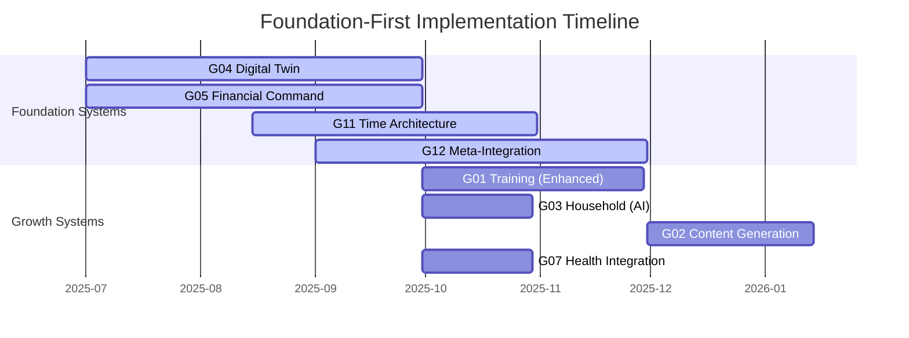
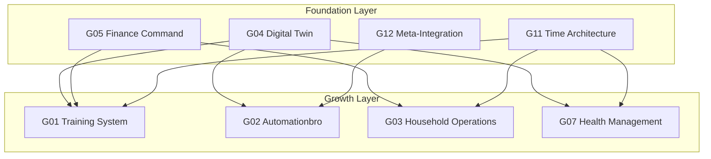

# ADR-0005: Foundation-First Goal Strategy

## Status
Accepted

## Context
The autonomous-living project has 12 goals covering different life domains. Without a clear strategy for prioritization and dependencies, we face:

### **Challenges with Flat Goal Structure**
- **Equal Priority Fallacy:** Treating all 12 goals as equally important
- **Resource Dilution:** Spreading limited time/money across too many objectives
- **Dependency Confusion:** No clear understanding of which goals enable others
- **Implementation Paralysis:** Too many parallel tracks without clear sequencing
- **Measurement Difficulty:** Hard to assess overall progress across diverse objectives

### **Specific Problem Patterns**
- **G01 Training** needs health insights but G07 not prioritized
- **G03 Household** needs financial constraints but G05 not integrated
- **G02 Content** needs material from all other goals but no system for collection
- **All goals** need time optimization but G11 not implemented
- **Documentation scattered** across systems with no central knowledge capture

## Decision
We will categorize goals into **Foundation Layer** (4 goals that enable others) and **Growth Layer** (8 goals that deliver value), focusing implementation on foundation goals first.

### **Goal Classification**

#### **Foundation Layer (Enablement Goals)**
**Purpose:** Create infrastructure and capabilities that enable and optimize other goals

1. **G04 - Digital Twin Ecosystem**
   - Central intelligence hub and data aggregator
   - Multi-channel AI interface for all systems
   - Cross-domain optimization and coordination
   - Enables intelligent orchestration of all other goals

2. **G05 - Autonomous Financial Command Center**
   - Resource allocation and budget automation platform
   - Real-time financial intelligence and constraint management
   - Enables resource-aware decision making across all goals
   - Provides budget constraints to household and training goals

3. **G11 - Intelligent Productivity & Time Architecture**
   - Time optimization and intelligent scheduling system
   - Energy-aware scheduling and resource allocation
   - Enables optimal time distribution across all goals
   - Coordinates timing and dependencies between systems

4. **G12 - Meta-System Integration & Continuous Optimization**
   - System orchestration and optimization engine
   - Cross-system dependency management and bottleneck resolution
   - Enables ecosystem-level optimization and learning
   - Monitors and coordinates all foundation systems

#### **Growth Layer (Application Goals)**
**Purpose:** Deliver specific domain value using foundation capabilities

5. **G01 - Reach Target Body Fat**
6. **G02 - Automationbro Recognition**
7. **G03 - Autonomous Household Operations**
8. **G06 - Pass Certification Exams**
9. **G07 - Predictive Health Management**
10. **G08 - Predictive Smart Home Orchestration**
11. **G09 - Complete Process Documentation**
12. **G10 - Automated Career Intelligence & Positioning**

### **Implementation Strategy**

#### **Phase 1: Foundation Infrastructure (Q1-Q2 2025)**


#### **Resource Allocation Strategy**
```yaml
time_allocation:
  foundation_phase: "80%"
    - g04_development: "40%"
    - g05_implementation: "25%"
    - g11_planning: "10%"
    - g12_integration: "5%"
  
  growth_phase: "20%"
    - maintenance_existing: "15%"
    - quick_wins: "5%"

financial_allocation:
  foundation_development: "60%"
  growth_goals: "20%"
  infrastructure: "15%"
  contingency: "5%"
```

### **Dependency Management**

#### **Foundation → Growth Dependencies**


#### **Implementation Dependencies**
```yaml
dependency_sequence:
  phase_1_foundation:
    - g04_basic_router: "Essential for any integration"
    - g05_database_setup: "Provides financial intelligence foundation"
    - data_models: "Standardized data exchange between systems"
  
  phase_2_advanced_foundation:
    - g11_time_optimization: "Requires data from G04, G05, G07"
    - g12_integration_engine: "Requires foundation systems to integrate"
    - g04_ai_enhancement: "Enhanced with G11 scheduling insights"
  
  phase_3_growth_acceleration:
    - ai_powered_growth_goals: "All growth goals enhanced by foundation"
    - cross_domain_optimization: "Multi-goal optimizations possible"
    - autonomous_coordination: "Systems coordinate without human intervention"
```

## Consequences

### **Positive Consequences**
- **Clear Prioritization:** Foundation goals get 80% of resources during initial phase
- **Accelerated Progress:** Foundation capabilities enable faster progress on growth goals
- **Dependency Clarity:** Clear understanding of which goals enable others
- **Resource Efficiency:** Eliminates resource waste on non-critical parallel tracks
- **Measurable Progress:** Foundation progress creates compound benefits across ecosystem
- **Reduced Complexity:** Team can focus on 4 foundation goals instead of 12 parallel goals

### **Negative Consequences**
- **Delayed Gratification:** Growth goals on hold during foundation phase
- **Foundation Risk:** If foundation goals fail, entire strategy collapses
- **Opportunity Cost:** Some growth opportunities might be missed during foundation phase
- **Complex Dependencies:** Foundation systems become critical dependencies for growth goals
- **Extended Timeline:** Longer time to see results in growth domains
- **Resource Concentration:** Heavy resource requirements for foundation development

## Implementation

### **Phase 1: Foundation Infrastructure (Months 1-6)**
#### **Priority 1: Core Foundation (G04 + G05)**
- Implement G04 basic router and data aggregation
- Complete G05 PostgreSQL database and basic automation
- Establish data exchange protocols between G04 and G05
- Implement basic monitoring and observability

#### **Priority 2: Time Management (G11)**
- Design G11 time architecture using data from G04 and G05
- Implement basic scheduling and optimization algorithms
- Create energy-aware scheduling using health data
- Integrate with G04 for intelligent time allocation

#### **Priority 3: Meta-Integration (G12)**
- Implement G12 as meta-system coordinator
- Create cross-system monitoring and optimization
- Build dependency resolution and bottleneck detection
- Integrate with all foundation systems for ecosystem optimization

### **Phase 2: Growth Acceleration (Months 7-12)**
#### **Foundation-Enhanced Growth Goals**
- Enhance G01 training with insights from G04, G07, G11
- Implement G03 household with financial constraints from G05
- Create G02 content pipeline using data from G12 and all systems
- Integrate G07 health management with G04 and G01 training data

#### **Cross-Domain Optimization**
- Implement health-training optimization loops
- Create budget-aware household automation
- Build intelligent content generation from all goal progress
- Implement time-aware multi-goal scheduling

### **Phase 3: Autonomous Coordination (Months 13+)**
#### **Full Ecosystem Intelligence**
- Implement AI-driven optimization across all domains
- Create predictive capabilities for resource allocation
- Build self-learning and adaptation mechanisms
- Implement autonomous goal prioritization and adjustment

## Alternatives Considered

### **Alternative 1: Parallel Implementation**
- Implement all 12 goals simultaneously with equal resources
- No foundation/growth distinction
**Rejected:**
- Resource dilution leads to slow progress everywhere
- No infrastructure foundation for growth goals
- Complex dependency management across 12 parallel tracks
- Higher risk of project failure due to overextension
- Measurement and coordination complexity

### **Alternative 2: Domain-Based Implementation**
- Group goals by domains (health, finance, productivity)
- Implement each domain independently
- Limited cross-domain integration
**Rejected:**
- Misses cross-domain optimization opportunities
- Siloed implementation prevents ecosystem benefits
- Still faces resource allocation challenges within domains
- No clear infrastructure foundation
- Reduces overall system intelligence

### **Alternative 3: MVP-First Strategy**
- Implement minimal version of all 12 goals quickly
- Focus on speed over comprehensive implementation
- Iterate on all goals in parallel
**Rejected:**
- Technical debt from rapid implementation
- No clear foundation for scaling improvements
- Risk of choosing wrong minimal features
- Complex coordination of 12 MVP systems
- Difficult to establish clear success metrics

### **Alternative 4: Opportunity-Driven Strategy**
- Implement goals based on immediate opportunities
- No fixed foundation/growth distinction
- Flexible prioritization based on external factors
**Rejected:**
- Lack of strategic direction
- No infrastructure foundation for long-term success
- Reactive rather than proactive approach
- Difficulty measuring overall progress
- Risk of strategic drift

## Related Decisions
- [ADR-0004](./ADR-0004-Digital-Twin-Architecture.md) - Digital Twin as Central Hub
- [ADR-0010](./ADR-0010-Hub-and-Spoke-Integration.md) - Hub-and-Spoke Integration Pattern
- [ADR-0003](./ADR-0003-Technology-Stack-Selection.md) - Technology Stack Selection

## Metrics

### **Success Criteria**
- **Foundation Completion:** All 4 foundation goals operational within 6 months
- **Integration Success:** 100% of foundation goals actively exchanging data
- **Growth Acceleration:** Growth goals show 2x faster progress with foundation support
- **Resource Efficiency:** 80% of development resources focused on foundation during initial phase
- **Ecosystem Intelligence:** Cross-domain optimizations generating measurable benefits

### **Performance Targets**
- **Foundation Development Time:** <6 months for complete foundation implementation
- **Integration Latency:** <1 hour data exchange between foundation systems
- **Growth Goal Enhancement:** 50% reduction in time to achieve growth milestones
- **Cross-Domain Optimization:** >3 cross-domain optimizations implemented per quarter
- **System Reliability:** >99.5% uptime across all foundation systems

### **Quality Assurance**
- **Dependency Satisfaction:** All growth goal dependencies satisfied by foundation
- **API Consistency:** Standardized interfaces across all foundation systems
- **Data Quality:** >95% data consistency across integrated systems
- **Documentation:** Complete architectural documentation for foundation systems
- **Testing:** >90% test coverage for foundation system integration

---

*Last updated: 2026-02-11*