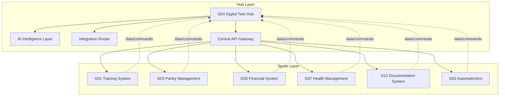

# ADR-0010: Hub-and-Spoke Integration Pattern

## Status
Accepted

## Context
The autonomous-living ecosystem needs to coordinate data and actions across 12 different goal systems:

### **Integration Challenges**
- **Data Silos:** Each system operates independently with no cross-system awareness
- **Duplicate Functionality:** Similar features implemented multiple times (user auth, data storage)
- **Coordination Complexity:** No central point for cross-system orchestration
- **Inconsistent State:** Different systems have conflicting views of reality
- **Development Overhead:** Each system needs to implement integration with every other system
- **User Experience Fragmentation:** Users must interact with multiple separate interfaces

### **Specific Integration Needs**
- **G04 Digital Twin:** Needs data from all systems for intelligence processing
- **G05 Financial System:** Needs to provide budget constraints to other systems
- **G01 Training System:** Needs health data from G07 for optimization
- **G03 Pantry Management:** Needs financial data from G05 for budget-aware shopping
- **G12 Documentation:** Needs activity data from all systems for knowledge capture

## Decision
We will implement a Hub-and-Spoke integration pattern with G04 Digital Twin as the central hub and all other systems as spokes.

### **Architecture Pattern**


### **Integration Patterns**

#### **Data Ingestion Pattern**
```python
class HubDataIngestion:
    def __init__(self):
        self.spoke_connectors = {
            'G01': G01Connector(),
            'G03': G03Connector(),
            'G05': G05Connector(),
            'G07': G07Connector(),
            'G12': G12Connector()
        }
        self.data_processor = DataProcessor()
    
    def ingest_all_data(self):
        """Collect data from all spokes"""
        for spoke_id, connector in self.spoke_connectors.items():
            try:
                data = connector.collect_data()
                normalized_data = self.data_processor.normalize(spoke_id, data)
                self.store_hub_data(spoke_id, normalized_data)
            except Exception as e:
                self.handle_ingestion_error(spoke_id, e)
    
    def provide_unified_context(self, requesting_spoke):
        """Provide cross-system context to requesting spoke"""
        relevant_data = self.get_relevant_data_for_spoke(requesting_spoke)
        return self.format_context_response(relevant_data)
```

#### **Command Distribution Pattern**
```python
class HubCommandRouter:
    def __init__(self):
        self.command_handlers = {
            'health_optimization': HealthOptimizationHandler(),
            'budget_constraint': BudgetConstraintHandler(),
            'time_scheduling': TimeSchedulingHandler(),
            'content_generation': ContentGenerationHandler()
        }
    
    def route_cross_system_command(self, command, target_systems):
        """Route command to multiple target systems"""
        results = {}
        for target_system in target_systems:
            try:
                connector = self.get_spoke_connector(target_system)
                result = connector.execute_command(command)
                results[target_system] = result
            except Exception as e:
                results[target_system] = {'error': str(e)}
        
        return self.aggregate_results(results)
```

### **Technical Implementation**

#### **Hub API Gateway**
```python
class HubAPIGateway:
    def __init__(self):
        self.authentication = AuthenticationService()
        self.rate_limiter = RateLimiter()
        self.request_router = RequestRouter()
    
    def handle_spoke_request(self, request, spoke_id):
        """Handle API request from spoke"""
        # Authentication
        if not self.authenticate_spoke(spoke_id, request):
            return {'error': 'Authentication failed'}
        
        # Rate limiting
        if not self.rate_limiter.allow_request(spoke_id):
            return {'error': 'Rate limit exceeded'}
        
        # Route to appropriate handler
        response = self.request_router.route(request, spoke_id)
        
        # Log the interaction
        self.log_spoke_interaction(spoke_id, request, response)
        
        return response
    
    def broadcast_to_spokes(self, message, target_spokes=None):
        """Broadcast message to multiple spokes"""
        if target_spokes is None:
            target_spokes = self.get_all_active_spokes()
        
        results = {}
        for spoke_id in target_spokes:
            try:
                connector = self.get_spoke_connector(spoke_id)
                result = connector.receive_broadcast(message)
                results[spoke_id] = result
            except Exception as e:
                results[spoke_id] = {'error': str(e)}
        
        return results
```

#### **Spoke Connector Interface**
```python
class SpokeConnector(ABC):
    @abstractmethod
    def collect_data(self) -> Dict[str, Any]:
        """Collect data from spoke system"""
        pass
    
    @abstractmethod
    def execute_command(self, command: Dict[str, Any]) -> Dict[str, Any]:
        """Execute command on spoke system"""
        pass
    
    @abstractmethod
    def receive_broadcast(self, message: Dict[str, Any]) -> Dict[str, Any]:
        """Receive broadcast from hub"""
        pass
    
    @abstractmethod
    def get_system_status(self) -> Dict[str, Any]:
        """Get current system status"""
        pass

class G01Connector(SpokeConnector):
    def collect_data(self):
        return {
            'workout_data': self.get_recent_workouts(),
            'body_fat_trends': self.get_body_fat_trends(),
            'training_metrics': self.get_training_metrics()
        }
    
    def execute_command(self, command):
        if command['type'] == 'optimize_training':
            return self.optimize_training_schedule(command['health_data'])
        elif command['type'] == 'update_goals':
            return self.update_training_goals(command['new_goals'])
        else:
            return {'error': f'Unknown command type: {command["type"]}'}
    
    def receive_broadcast(self, message):
        if message['type'] == 'financial_constraint':
            return self.adjust_training_intensity(message['budget_data'])
        elif message['type'] == 'health_recommendation':
            return self.apply_health_guidance(message['health_insights'])
        else:
            return {'status': 'broadcast_received'}
```

## Consequences

### **Positive Consequences**
- **Centralized Intelligence:** Hub can analyze cross-system data for insights
- **Simplified Development:** Spokes only need to integrate with hub, not each other
- **Consistent State:** Hub maintains single source of truth
- **Scalability:** Easy to add new spokes without complex integration logic
- **Unified User Experience:** Single interface (through hub) for cross-system interactions
- **Cross-System Optimization:** Hub can coordinate actions across multiple domains
- **Reduced Duplication:** Shared functionality implemented once in hub

### **Negative Consequences**
- **Hub Dependency:** Spokes depend on hub for cross-system functionality
- **Single Point of Failure:** Hub failure affects entire ecosystem
- **Performance Bottleneck:** All cross-system communication goes through hub
- **Complex Hub:** Hub becomes complex system managing all integrations
- **Network Overhead:** Additional network latency for cross-system communication
- **Development Complexity:** Initial hub implementation is complex

## Implementation

### **Phase 1: Hub Foundation**
- Implement central API gateway with authentication and rate limiting
- Create spoke connector interface and base implementations
- Build data ingestion pipeline for initial spokes (G01, G05)
- Implement basic command routing between hub and spokes

### **Phase 2: Spoke Integration**
- Implement connectors for all active systems (G03, G07, G12)
- Create standardized data models for cross-system communication
- Build command execution patterns for each spoke type
- Implement error handling and recovery mechanisms

### **Phase 3: Advanced Features**
- Implement intelligent command orchestration across multiple spokes
- Add real-time event streaming between hub and spokes
- Create conflict resolution for competing cross-system actions
- Implement predictive command suggestions based on system state

### **Phase 4: Optimization & Monitoring**
- Optimize performance of hub-spoke communication
- Add comprehensive monitoring of hub and spoke health
- Implement automated recovery from spoke failures
- Create analytics on cross-system interaction patterns

## Alternatives Considered

### **Alternative 1: Full Mesh Architecture**
- Each spoke integrates directly with every other spoke
- No central hub, peer-to-peer communication
**Rejected:**
- Exponential complexity: N² connections for N spokes
- Each spoke needs to implement integration with every other spoke
- No unified intelligence or coordination
- Network complexity becomes unmanageable
- Inconsistent integration patterns across spokes

### **Alternative 2: Event Bus Only**
- Central message bus for events, no hub intelligence
- Spokes publish events and subscribe to relevant events
- No central coordination or command routing
**Rejected:**
- No unified intelligence or optimization
- Complex event schema management
- Difficult to implement cross-system command coordination
- Event ordering and consistency challenges
- Limited ability to provide unified context

### **Alternative 3: Hierarchical Architecture**
- Multiple layers of hubs (domain hubs, ecosystem hub)
- Complex hierarchy with multiple coordination points
**Rejected:**
- Over-complex for personal system
- Multiple points of failure
- Difficult to maintain and debug
- User confusion about which hub to interact with
- Excessive coordination overhead

### **Alternative 4: Decentralized Federation**
- Autonomous spokes with voluntary data sharing
- No central authority, peer-based cooperation
**Rejected:**
- No unified intelligence or coordination
- Complex consensus mechanisms needed
- Difficult to ensure data consistency
- High development and maintenance overhead
- Poor user experience for cross-system interactions

## Related Decisions
- [ADR-0004](./ADR-0004-Digital-Twin-Architecture.md) - Digital Twin as Central Hub
- [ADR-0011](./ADR-0011-Event-Driven-Architecture.md) - Event-Driven Architecture
- [ADR-0012](./ADR-0012-API-First-Design.md) - API-First Design Principle

## Metrics

### **Success Criteria**
- **Integration Coverage:** 100% of active systems connected as spokes
- **Cross-System Actions:** >50% of optimizations involve multiple spokes
- **Response Time:** <2 seconds for hub-spoke communication
- **System Coordination:** Hub successfully orchestrates actions across >3 spokes
- **Development Efficiency:** New spoke integration takes <3 days instead of weeks

### **Performance Targets**
- **Hub Response Time:** <1 second for API requests
- **Command Latency:** <5 seconds from command to spoke execution
- **Data Freshness:** <1 hour latency from spoke to hub data
- **Error Rate:** <1% of hub-spoke interactions fail
- **Concurrent Connections:** Support 50+ simultaneous spoke connections

### **Reliability Requirements**
- **Hub Uptime:** >99.95% availability
- **Spoke Connectivity:** >99% of spokes connected at any time
- **Recovery Time:** <2 minutes from spoke failure to reconnection
- **Data Consistency:** >99.9% consistency between hub and spokes
- **Failover:** Automatic failover for critical hub functions

---

*Last updated: 2026-02-11*