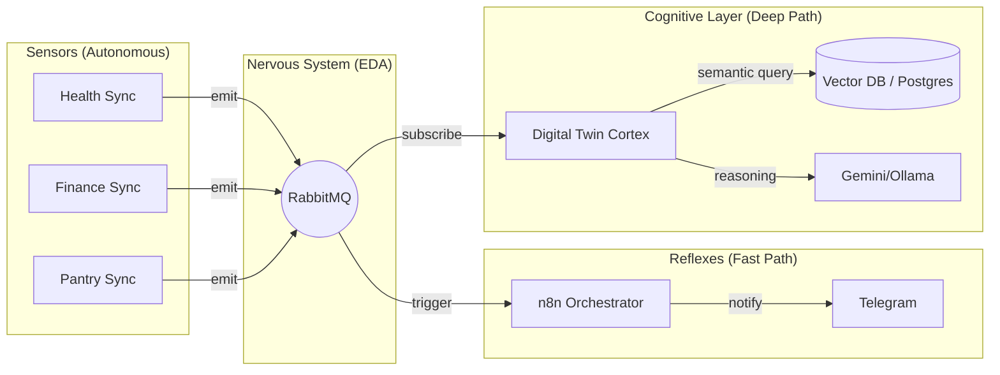

# Adr-0031: Life-Nervous-System Architecture (Autonomous Agent Mesh)

## Status
Accepted

## Context
As the system moved into Q2 2026 ("First Real Wins"), the **Hub-and-Spoke** model (Adr-0010) became a major bottleneck. 
- **Latency:** Polling and sequential REST calls created delays in critical reactions (e.g., bio-feedback schedule pivoting).
- **Rigidity:** Adding new "spokes" required complex updates to the "Hub" (G04) logic.
- **Cognitive Load:** The "Hub" (G04) was forced to handle both high-level intelligence and low-level event routing, leading to bloated code and brittle integrations.

## Decision
We are transitioning to the **Life-Nervous-System Architecture**, a decentralized mesh of autonomous agents connected by a high-speed event bus.

### **Architectural Shift**
- **From Hub-and-Spoke to Mesh:** Instead of G04 being the center of all communication, every system (Agent) acts as an autonomous "Neuron".
- **From Polling to Reactivity:** Agents emit `LifeEvents` to RabbitMQ (`life.events`) immediately upon state changes.
- **The Digital Twin (G04) as the "Cognitive Cortex":** G04 is no longer the router; it is a high-level subscriber that maintains long-term memory, provides semantic search, and handles complex multi-domain reasoning.
- **n8n as the "Reflex System":** n8n workflows trigger on specific events (Reflexes) to perform near-instant tasks (e.g., Telegram alerts, schedule pivots) without G04 intervention.

### **Component Roles**
| Role | Component | Function |
| :--- | :--- | :--- |
| **Backbone** | RabbitMQ | Low-latency message distribution (The Spinal Cord). |
| **Sensors** | Sync Scripts | Capture reality (Health, Finance, Pantry) and emit events. |
| **Reflexes** | n8n Workflows | Instant response to specific signals (e.g., `biometric_inserted`). |
| **Cortex** | Digital Twin (G04) | Deep analysis, long-term state tracking, and intent resolution. |
| **Effectors** | Action Agents | Perform physical changes (e.g., `G10_calendar_enforcer.py`). |

### **Communication Pattern**

## Consequences

### **Positive Consequences**
- **Zero-Latency Response:** Actions happen milliseconds after data ingestion.
- **Decoupled Development:** New agents can be added by simply subscribing to the bus—no changes needed to G04 core.
- **Resilience:** If G04 (Cortex) is down, the Reflexes (n8n/Sensors) still function.
- **Scalability:** Handles high-frequency telemetry (ActivityWatch, Smart Home) without clogging the main API.

### **Negative Consequences**
- **Distributed Complexity:** Debugging requires following event chains across multiple logs.
- **Event Schema Governance:** Changes to event payloads must be coordinated to prevent breaking subscribers.
- **Infrastructure Dependency:** The system is now heavily dependent on the RabbitMQ broker health.

## Implementation
- **Standard:** Use `G11_event_emitter.py` for all producers.
- **Trigger:** Replace Cron schedules in n8n with RabbitMQ Trigger nodes.
- **Bridge:** Maintain `G11_db_event_bridge.py` for legacy database-level events.

## Related Decisions
- [Adr-0010](Adr-0010-Hub-and-Spoke-Integration.md) - Superseded
- [Adr-0016](Adr-0016-Event-Driven-Architecture.md) - Foundation
- [Adr-0004](Adr-0004-Digital-Twin-Architecture.md) - Redefined G04 Role

---
*Last updated: 2026-05-12*
