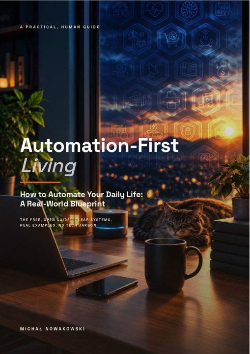

# 📖 Automation-First Living

### How to Automate Your Daily Life — A Real-World Blueprint

> Stop carrying your life around in your head. The ordinary can run itself
> so you keep the meaningful.

Your brain can only hold ~4 things at once — yet you manage hundreds of
micro-decisions a day. This blueprint shows you, step by step, how to build a
system that catches the load when life gets busy: **money, health, home, time,
and work**, all pulled into one self-running loop.

**Real systems. Real examples. No jargon.**

*Click the cover to download the PDF (37 pages, free).*

---

## What's inside

- **A morning that runs itself** — what autonomy actually looks like in a normal home.
- **Why another app won't fix it** — the architecture problem behind "digital life".
- **When buying makes sense** — and when building your own wins.
- **Start simple, then let it think** — a practical week-by-week on-ramp.
- **Your private life stays private** — data ownership as a feature.
- **Your first week** — one small change that compounds.

Written from twenty years of enterprise automation engineering, applied to
real life — not from a theory book.

---

## ☕ Free forever — pay what you like

The ebook is (and stays) free. If it saves you an hour or a headache, you can
support the work with whatever feels right — even a single coffee helps keep
this open-source blueprint going.

| Suggested | Amount |
|-----------|--------|
| 🥰 Just the book | Free (0 zł) |
| ☕ Fuel the architecture | 9 zł |
| 🔧 Keep the homelab running | 19 zł |
| 🚀 One step closer to the North Star | 49 zł |

## 💌 Continue the journey

Real-world follow-ups, automation patterns, and the build-in-public story:
[The Automation Way — automationbro.substack.com](https://automationbro.substack.com)

---

© 2026 Michał Nowakowski · Automationbro